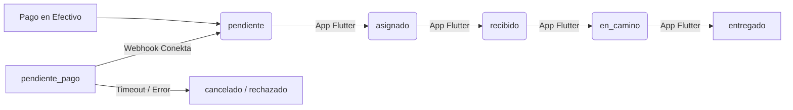

# 🌟 Estrella Delivery — Arquitectura del Sistema
> Documento vivo para desarrolladores. Última actualización: junio 2026.

---

## Tabla de Contenidos
1. [Mapa del sistema](#1-mapa-del-sistema)
2. [Repositorios y apps](#2-repositorios-y-apps)
3. [Base de datos (Supabase)](#3-base-de-datos-supabase)
4. [Flujo de registro de restaurantes](#4-flujo-de-registro-de-restaurantes)
5. [Sistema de identidad — email canónico](#5-sistema-de-identidad--email-canónico)
6. [Portal B2B — restaurantes-estrella](#6-portal-b2b--restaurantes-estrella)
7. [App cliente — loyalty-estrella (src/)](#7-app-cliente--loyalty-estrella-src)
8. [Bot de WhatsApp — whatsapp-bot](#8-bot-de-whatsapp--whatsapp-bot)
9. [Edge Functions (Supabase)](#9-edge-functions-supabase)
10. [Variables de entorno](#10-variables-de-entorno)
11. [Convenciones y reglas del sistema](#11-convenciones-y-reglas-del-sistema)

---

## 1. Mapa del sistema

```
┌─────────────────────────────────────────────────────────────────────┐
│                    USUARIOS FINALES                                  │
│                                                                      │
│  📱 Clientes          🍽️ Dueños de Restaurante      👨‍💼 Admin        │
│  (app pública)        (portal B2B web)               (WhatsApp)      │
└────────┬──────────────────────┬──────────────────────────┬───────────┘
         │                      │                          │
         ▼                      ▼                          ▼
┌─────────────────┐  ┌────────────────────┐  ┌────────────────────────┐
│  App Cliente    │  │  Portal B2B         │  │  WhatsApp Business API │
│  Vite + React   │  │  (restaurantes-     │  │  Meta Cloud API        │
│  /restaurantes  │  │   estrella/)        │  │                        │
│  /loyalty/:tel  │  │  /login, /portal    │  │                        │
│  /pedido/:id    │  │  /menu/:slug        │  │                        │
└────────┬────────┘  └─────────┬──────────┘  └──────────┬─────────────┘
         │                     │                         │
         └──────────────────┬──┘                         │
                            │                            │
                            ▼                            ▼
              ┌─────────────────────────────────────────────────────┐
              │                  SUPABASE                            │
              │                                                      │
              │  PostgreSQL DB  │  Auth  │  Storage  │  Edge Funcs  │
              └──────────────────────────────────────────────────────┘
```

---

## 2. Repositorios y apps

El proyecto vive en **un solo repositorio monorepo** en `loyalty-estrella/`.

| Directorio | Qué es | URL en producción |
|---|---|---|
| `src/` | App cliente (Vite+React) | `app-estrella.shop` |
| `restaurantes-estrella/` | Portal B2B (Vite+React) | `restaurantes-app-estrella.shop` |
| `supabase/functions/` | Edge Functions (Deno) | `*.supabase.co/functions/v1/*` |
| `admin_app/` | Panel admin interno | local / privado |

### Tecnologías principales
- **Frontend:** React + TypeScript + Vite + TailwindCSS
- **Animaciones:** Framer Motion
- **Backend:** Supabase (Postgres + Auth + Storage + Edge Functions en Deno)
- **Mensajería:** WhatsApp Business Cloud API (Meta)
- **AI:** OpenAI GPT-4o (en `whatsapp-ai` y `whatsapp-bot/ai.ts`)
- **Mapas:** H3 (Uber), KML

---

## 3. Base de datos (Supabase)

### Tablas principales

#### `restaurantes` — La tabla central
```sql
id                    uuid PK
nombre                text
telefono              text UNIQUE     -- 10 dígitos, sin código país
slug                  text UNIQUE     -- slugify(nombre) + "-" + right(tel,4)
admin_id              uuid FK → auth.users
activo                boolean         -- el restaurante puede operar
perfil_completo       boolean         -- trigger automático (ver §3.1)
foto_fachada_url      text            -- foto de portada (Storage)
logo_url              text
descripcion_corta     text
correo                text            -- correo de CONTACTO real (≠ email de Auth)
categorias            text[]          -- ej: ['Comida mexicana','Pizzas']
horarios              jsonb           -- { lunes: {abre,cierra,activo}, ... }
hora_apertura         text            -- legacy, usar horarios
hora_cierre           text            -- legacy, usar horarios
programa_lealtad_activo boolean
es_socio              boolean
direccion             text
```

> **⚠️ IMPORTANTE:** El campo `correo` aquí es el email real del negocio (para soporte/contacto). El email usado en Supabase Auth es `aliado_${telefono}@app-estrella.shop`. Son distintos. Ver §5.

#### `restaurantes_solicitudes` — Cola de registro pendiente
```sql
id                    uuid PK
nombre_restaurante    text
encargado             text
telefono              text     -- 10 dígitos, sin código país
correo                text     -- email de contacto opcional (NO es el email de Auth)
categoria             text
direccion             text
estado                text     -- 'pendiente' | 'aprobado' | 'rechazado'
creado_en             timestamptz
```

#### `menu_categorias` — Categorías del menú
```sql
id, restaurante_id FK, nombre, emoji, orden, activa
```

#### `menu_items` — Platillos
```sql
id, restaurante_id FK, categoria_id FK, nombre, descripcion,
precio, foto_url, disponible, es_popular, orden,
opciones jsonb  -- [{titulo, requerido, maximo_selecciones, opciones:[{nombre,precio_extra}]}]
```

#### `menu_combos` y `menu_promociones` — Combos y promos
```sql
-- combos: incluye text[] (lista de productos incluidos)
-- promociones: precio_especial, fecha_fin, activa
```

#### `clientes` — Usuarios del programa de lealtad
```sql
id, nombre, telefono, puntos, nivel, reputacion,
referido_por, codigo_referido, creado_en
```

#### `pedidos` — Mandaditos (delivery)
```sql
id, cliente_id FK, repartidor_id FK, restaurante_id FK,
estado, origen, destino, precio, notas, creado_en
```

#### `repartidores`
```sql
id, nombre, alias, telefono, user_id FK → auth.users,
activo, zona_actual
```

#### `bot_memory` — Memoria conversacional del bot
```sql
phone    text PK   -- número completo con código país (ej: 529631234567)
history  jsonb     -- array de mensajes [{role, content}]
```

---

### 3.1 Trigger: `perfil_completo`

Un trigger `BEFORE INSERT OR UPDATE` en `restaurantes` evalúa automáticamente si el perfil está listo para mostrarse en el directorio público:

```sql
-- Se activa en: UPDATE restaurantes SET foto_fachada_url = '...'
-- Condición para perfil_completo = TRUE:
--   1. foto_fachada_url IS NOT NULL AND != ''
--   2. categorias IS NOT NULL AND array_length > 0
--   3. Al menos un día activo en horarios

-- Función: check_perfil_completo()
-- Trigger: trg_check_perfil_completo (BEFORE INSERT OR UPDATE)
```

El frontend **no controla** `perfil_completo` directamente. Solo la BD lo sabe.

---

### 3.2 Storage buckets

| Bucket | Uso |
|---|---|
| `menu-fotos` | Fotos de platillos, combos, promos, fachadas de restaurantes |
| `restaurantes` | PDFs de bienvenida para aliados |

Las imágenes se comprimen a **WebP 80%** antes de subir (ver `subirFoto()` en `restaurantes-estrella/src/lib/supabase.ts`).

---

## 4. Flujo de registro de restaurantes

```
PASO 1 — El dueño del restaurante inicia solicitud
━━━━━━━━━━━━━━━━━━━━━━━━━━━━━━━━━━━━━━━━━━━━━━━━━

  VÍA A: WhatsApp Flow (recomendada)
    whatsapp-flows/index.ts
    → payload.accion = "REGISTRO_RESTAURANTE"
    → INSERT restaurantes_solicitudes {
        nombre_restaurante, encargado, categoria,
        direccion, telefono (10 dígitos),
        correo: `aliado_${tel10}@app-estrella.shop`  ← email canónico
      }

  VÍA B: Bot conversacional (whatsapp-ai)
    whatsapp-ai/index.ts
    → accion = 'REGISTRAR_RESTAURANTE'
    → INSERT restaurantes_solicitudes {
        nombre_restaurante, telefono,
        correo: correo_real_del_cliente_o_null  ← solo de contacto
      }

  En ambas vías → el admin recibe alerta por WA con botones Aprobar/Rechazar


PASO 2 — Admin aprueba
━━━━━━━━━━━━━━━━━━━━━━

  VÍA A: Link HTTP
    admin-approval/index.ts?action=accept&tel=...&secret=...
    → Crea usuario en Supabase Auth con email canónico
    → INSERT restaurantes { nombre, telefono, slug, activo:true, ... }
    → Envía credenciales por WA al dueño

  VÍA B: Botón en WhatsApp del admin
    button-handler.ts → flow_rest_accept_${tel}
    → Exactamente el mismo proceso que VÍA A


PASO 3 — Dueño entra al portal
━━━━━━━━━━━━━━━━━━━━━━━━━━━━━━

  restaurantes-app-estrella.shop → LoginPage
  → Ingresa: teléfono (10 dígitos) + contraseña
  → Construye email: `aliado_${phone}@app-estrella.shop`
  → supabase.auth.signInWithPassword({ email, password })
  → Si OK → PortalPage
  → getMyRestaurante() → restaurantes WHERE admin_id = user.id


PASO 4 — Dueño completa perfil
━━━━━━━━━━━━━━━━━━━━━━━━━━━━━━

  PerfilView.tsx → sube foto de fachada + selecciona categorías + horarios
  → UPDATE restaurantes SET foto_fachada_url=..., categorias=..., horarios=...
  → Trigger evalúa → perfil_completo = TRUE
  → El restaurante aparece en el directorio público (/restaurantes en app cliente)
```

---

## 5. Sistema de identidad — email canónico

> **Regla de oro:** El email de Supabase Auth para dueños de restaurante SIEMPRE es:
> ```
> aliado_${telefono10digitos}@app-estrella.shop
> ```

### ¿Por qué?
- El dueño se identifica naturalmente por su **teléfono de WhatsApp**
- No queremos depender de que el dueño recuerde un correo electrónico
- El login del portal usa teléfono → construye el email internamente → no se expone al usuario

### Archivos que generan este email
| Archivo | Dónde |
|---|---|
| `LoginPage.tsx` | `const email = \`aliado_${phone}@app-estrella.shop\`` |
| `admin-approval/index.ts` | `const authEmail = \`aliado_${tel}@app-estrella.shop\`` |
| `button-handler.ts` | `const authEmail = \`aliado_${restTel}@app-estrella.shop\`` |
| `whatsapp-flows/index.ts` | `correo: \`aliado_${tel10}@app-estrella.shop\`` |

### Repartidores (sistema análogo)
Los repartidores usan: `${telefono10}@repartidor.com`  
Creado en `admin-create-user/index.ts`.

---

## 6. Portal B2B — `restaurantes-estrella/`

### Rutas
```
/             → PublicLandingPage  (directorio público de restaurantes)
/menu/:slug   → PublicMenuView     (menú público de un restaurante)
/login        → LoginPage          (solo si no hay sesión)
/portal       → PortalPage         (solo si hay sesión activa)
```

### PortalPage — Tabs internas
```
PortalPage
├── DashboardView    — Link al menú digital, QR, estadísticas básicas
├── MenuProductosView — CRUD de platillos (con fotos, categorías, opciones)
├── MenuCombosView   — CRUD de combos
├── MenuPromosView   — CRUD de promociones
└── PerfilView       — Foto de fachada, categorías, horarios, descripción
```

### Lógica del portal
1. Al cargar: `getMyRestaurante()` → busca `restaurantes WHERE admin_id = auth.user.id`
2. Si `restaurante == null` → pantalla "Acceso pendiente" con link a WhatsApp de soporte
3. Si `restaurante.perfil_completo == false` → banner de alerta SOLO en el tab Dashboard
4. Onboarding driver.js: se muestra 1 sola vez por restaurante (`localStorage: onboarding_b2b_done_${restaurante.id}`)
   - Si perfil incompleto → el onboarding prioriza el paso de completar perfil
   - Si perfil completo → tour normal de todas las secciones

### Visibilidad pública (`PublicLandingPage`)
El directorio de restaurantes filtra:
```sql
SELECT * FROM restaurantes
WHERE activo = true AND perfil_completo = true
ORDER BY nombre
```
Un restaurante recién aprobado NO aparece hasta que el dueño completa su perfil.

---

## 7. App cliente — `loyalty-estrella/src/`

### Rutas (`src/App.tsx`)
```
/                → Home           (landing principal de Estrella Delivery)
/cliente         → ClienteView    (perfil de cliente, puntos de lealtad)
/loyalty/:tel    → ClienteView    (acceso directo por teléfono)
/restaurantes    → RestaurantesPage (directorio de restaurantes)
/restaurantes/:id → RestauranteMenuPage (menú de un restaurante)
/pedido/:id      → PedidoView     (seguimiento de pedido para repartidores)
/terminos        → Terminos
/map-editor      → MapEditor      (editor de zonas KML)
/h3-editor       → H3MapEditor    (editor de hexágonos H3)
```

### Componentes clave
- **FlashBanner:** Banner de promociones que aparece en rutas de cliente
- **SplashScreen:** Pantalla de carga inicial (una vez por sesión)
- **ClienteView:** Tarjeta de lealtad, historial de puntos, código QR personal

---

## 8. Bot de WhatsApp — `whatsapp-bot/`

El bot vive en `supabase/functions/whatsapp-bot/` y es el sistema más complejo del proyecto.

### Archivo de entrada: `index.ts`
Recibe todos los webhooks de WhatsApp y los distribuye:

```
Mensaje entra
    │
    ├── ¿Es botón/lista interactiva? → button-handler.ts
    ├── ¿Es multimedia (imagen/audio)? → media-handler.ts
    ├── ¿Es texto?
    │       ├── ¿Usuario es admin? → admin-handler.ts
    │       ├── ¿Usuario es repartidor? → rep-handler.ts
    │       ├── ¿Usuario es restaurante aliado? → restaurant-b2b-handler.ts
    │       └── ¿Usuario es cliente? → ai.ts (GPT-4o)
    └── ¿Es evento de cron? → cron-handler.ts
```

### Módulos del bot

| Archivo | Responsabilidad |
|---|---|
| `index.ts` | Router principal, identificación de usuario |
| `ai.ts` | Conversación con GPT-4o, memoria, extracción de intenciones |
| `admin-handler.ts` | Comandos de admin: ver pedidos, stats, mensajes masivos |
| `admin-flow.ts` | Flujos de aprobación (VIP, restaurantes) para el admin |
| `button-handler.ts` | Manejo de botones interactivos (aprobaciones, calificaciones) |
| `rep-handler.ts` | Menú y comandos del repartidor |
| `restaurant-b2b-handler.ts` | Catálogo de restaurantes, menú para clientes |
| `restaurant-onboarding.ts` | Onboarding por WA para restaurantes recién aprobados |
| `mandadito-handler.ts` | Flujo completo de pedidos delivery (mandaditos) |
| `slash-commands-handler.ts` | Comandos con `/` para el admin |
| `client-flow.ts` | Flujo de registro de clientes VIP |
| `client-profile-handler.ts` | Perfil del cliente, consulta de puntos |
| `cron-handler.ts` | Tareas programadas: recordatorios, reportes diarios |
| `chatwoot-sync.ts` | Sincronización con Chatwoot (CRM) |
| `media-handler.ts` | Procesamiento de imágenes y audios |
| `db.ts` | Helpers de base de datos comunes al bot |
| `whatsapp.ts` | Funciones de envío de mensajes (texto, imagen, documento, botones) |
| `kml_data.ts` | Datos de zonas de cobertura en formato KML |
| `simulador_criterio.ts` | Simulador del algoritmo de asignación de repartidores |

### Identificación de usuarios
Al recibir un mensaje, el bot identifica al usuario consultando estas tablas en orden:
1. `restaurantes` WHERE telefono = from10 → es aliado (`restaurante`)
2. `repartidores` WHERE telefono = from10 → es repartidor
3. Hardcoded ADMIN_PHONES env → es admin
4. `clientes` WHERE telefono = from10 → es cliente registrado
5. Si ninguno → es visitante nuevo

---

## 9. Edge Functions (Supabase)

Todas viven en `supabase/functions/` y se despliegan con `supabase functions deploy`.

| Función | Trigger | Qué hace |
|---|---|---|
| `whatsapp-bot` | POST de Meta (webhook) | Bot principal de WhatsApp |
| `whatsapp-ai` | POST de Meta (webhook) | Bot alternativo con AI pura (sin lógica de negocio) |
| `whatsapp-flows` | POST de Meta (webhook) | Procesa respuestas de WhatsApp Flows (formularios nativos) |
| `whatsapp-ventas` | POST de Meta (webhook) | Bot enfocado en ventas/promociones |
| `admin-approval` | GET/POST HTTP | Aprueba o rechaza solicitudes de restaurantes |
| `admin-create-user` | POST HTTP (autenticado) | Crea usuarios repartidores/admin con PIN |
| `auth-otp` | POST HTTP | Autenticación OTP para clientes (sin contraseña) |
| `canjear-puntos` | POST HTTP | Lógica de canje de puntos de lealtad |
| `generar-tarjeta` | POST HTTP | Genera imagen PNG de la tarjeta de lealtad |
| `notificar-whatsapp` | POST HTTP | Envía notificaciones WA programadas |
| `chatwoot-bot` | POST (webhook Chatwoot) | Sincroniza mensajes con el CRM |
| `upload-kml` | POST HTTP | Carga zonas KML al sistema |

### Autenticación de Edge Functions
- **Con `service_role`:** `admin-approval`, `admin-create-user`, `canjear-puntos`, `generar-tarjeta`
- **Con webhook secret de Meta:** `whatsapp-bot`, `whatsapp-ai`, `whatsapp-flows`, `whatsapp-ventas`
- **Con ADMIN_APPROVAL_SECRET:** `admin-approval` vía GET con `?secret=`

---

## 10. Variables de entorno

### Portal B2B (`restaurantes-estrella/.env`)
```env
VITE_SUPABASE_URL=https://xxxx.supabase.co
VITE_SUPABASE_ANON_KEY=eyJ...
```

### App cliente (`loyalty-estrella/.env`)
```env
VITE_SUPABASE_URL=https://xxxx.supabase.co
VITE_SUPABASE_ANON_KEY=eyJ...
```

### Edge Functions (Supabase secrets)
```env
SUPABASE_URL                 # Autoinyectado por Supabase
SUPABASE_SERVICE_ROLE_KEY    # Autoinyectado por Supabase
WHATSAPP_TOKEN               # Token de Meta Business
WHATSAPP_PHONE_ID            # ID del número de WA Business
WHATSAPP_VERIFY_TOKEN        # Para verificar webhooks de Meta
ADMIN_PHONES                 # Lista de teléfonos admin separados por coma (ej: 9631234567,9611234567)
ADMIN_APPROVAL_SECRET        # Secret para proteger el endpoint admin-approval
OPENAI_API_KEY               # Para GPT-4o en whatsapp-ai y whatsapp-bot/ai.ts
PDF_BIENVENIDA_URL           # URL pública del PDF de bienvenida para aliados
```

---

## 11. Convenciones y reglas del sistema

### Teléfonos
- Siempre almacenados como **10 dígitos** sin código de país (ej: `9631234567`)
- Para enviar por API de Meta: `52${tel10}` (ej: `529631234567`)
- Para WhatsApp desde el bot, el número entrante (`fromPhone`) ya viene con `521...` → se trunca con `.slice(-10)`

### Slugs de restaurantes
- Formato: `slugify(nombre) + "-" + right(telefono, 4)`
- Ejemplo: `"La Taquería Pepe's"` + tel `9631234567` → `la-taqueria-pepes-4567`
- Función `slugify`: convierte a minúsculas, remueve tildes, reemplaza espacios con guiones
- Generado al momento de la aprobación. Una vez creado, **no cambia**.

### Imágenes
- Siempre se comprimen a **WebP 80%** antes de subir al Storage
- Bucket: `menu-fotos` (público)
- Path convention: `restaurantes/{restaurante_id}/foto_fachada.webp`

### `perfil_completo`
- **No modificar manualmente.** Es calculado por el trigger `trg_check_perfil_completo`.
- Solo se vuelve `true` cuando los 3 requisitos están presentes: foto + categorías + horarios.
- Controla si el restaurante aparece en el directorio público.

### Bot memory
- La memoria conversacional del bot se guarda en `bot_memory` con la llave = teléfono completo con código de país.
- Se limpia con `DELETE FROM bot_memory WHERE phone = from10` al completar un flujo.
- La memoria de solicitudes pendientes usa `pending_rest_${tel}` como llave especial.

### RPC Functions útiles
```sql
get_user_id_by_email(email_to_search text) → uuid
-- Busca un usuario en auth.users por email (requiere service_role)
```

---

## Diagrama de flujo de registro completo

```
Dueño de restaurante (WhatsApp)
          │
          │  "Quiero registrar mi restaurante"
          ▼
  ┌───────────────────┐     ┌──────────────────────┐
  │  whatsapp-flows   │ o   │    whatsapp-ai        │
  │  (Flow nativo WA) │     │  (chat conversacional)│
  └────────┬──────────┘     └──────────┬────────────┘
           │                           │
           └──────────┬────────────────┘
                      │ INSERT restaurantes_solicitudes
                      │ estado = 'pendiente'
                      ▼
           Admin recibe alerta por WA
                      │
          ┌───────────┴────────────┐
          │                        │
          ▼                        ▼
   Botón en WA               Link HTTP
   button-handler.ts         admin-approval/index.ts
   flow_rest_accept_...      ?action=accept&tel=...
          │                        │
          └──────────┬─────────────┘
                     │
                     ├─ createUser en Auth
                     │  email: aliado_${tel}@app-estrella.shop
                     │  password: Estrella${random}*
                     │
                     ├─ INSERT restaurantes
                     │  { nombre, telefono, slug, activo:true,
                     │    perfil_completo:false ← trigger
                     │    programa_lealtad_activo:true }
                     │
                     └─ Envía credenciales por WA:
                        "Usuario: tu teléfono / Clave: Estrella1234*"
                        URL: restaurantes-app-estrella.shop

                     ↓ Dueño entra al portal

             LoginPage → phone + password
                     │
                     └─ email: aliado_${phone}@app-estrella.shop
                        supabase.auth.signInWithPassword()
                     │
                     ▼
             PortalPage → getMyRestaurante()
                     │
        ┌────────────┴───────────────┐
        │ perfil_completo = false    │ perfil_completo = true
        │ Banner de alerta visible   │ Acceso total al portal
        │ Onboarding guía a PerfilView │ Onboarding tour normal
        └────────────────────────────┘
                     │
             Dueño llena:
             - Foto de fachada
             - Categorías
             - Horarios
                     │
             UPDATE restaurantes → trigger evalúa
                     │
             perfil_completo = TRUE ✅
                     │
                     │
             Aparece en /restaurantes (app cliente)
             y en PublicLandingPage (portal)
```

---

## 12. Arquitectura de Flujos Asíncronos y Pagos (Conekta)

El ecosistema opera bajo una arquitectura distribuida orientada a eventos (Event-Driven). Los flujos más críticos dependen de transiciones de estado precisas y del manejo de concurrencia.

### 12.1. Patrón "Fallback" de Doble Vía (Double-Check en Checkout)

Cuando el cliente paga con tarjeta (Conekta), es redirigido a `SuccessPage.tsx`. El reto técnico es saber **cuándo** el webhook de Conekta aprobó el pago en nuestro backend, sin depender de recargas manuales.

Implementamos un mecanismo dual gestionado por referencias de React (`useRef`):
1.  **Vía Primaria (WebSockets):** `supabase.channel('wait-payment')`. Reacciona en milisegundos cuando la Edge Function modifica la base de datos.
2.  **Vía Secundaria (Short-Polling HTTP):** `setInterval` cada 3 segundos como respaldo si los WebSockets son bloqueados por VPNs o fallos de conexión.
3.  **Coordinación (Mutex Local):** Variables como `resolvedRef.current` actúan como semáforos. Quien reciba el estado de `pendiente` primero (Socket o HTTP), bloquea la bandera y mata el proceso competidor (`clearInterval`), asegurando que eventos únicos (como lanzar confeti o borrar el carrito) ocurran exactamente una vez $O(1)$.

### 12.2. Idempotencia en Pagos (Webhook Conekta)

El endpoint de Deno (`conekta-webhook/index.ts`) está diseñado para ser **idempotente**. Conekta puede reenviar el mismo evento `order.paid` múltiples veces debido a latencias de red.

**Implementación de Seguridad:**
El backend aplica un `Guard` explícito a nivel de base de datos usando `UPDATE ... WHERE estado = 'pendiente_pago'`.
Si Conekta envía un evento duplicado, la segunda consulta fallará inofensivamente (devuelve 0 filas afectadas) porque el pedido ya no está en `pendiente_pago`. Esto evita procesamientos dobles y que se envíen múltiples mensajes de WhatsApp al restaurante aliado.

### 12.3. Máquina de Estados (State Machine)

El ciclo de vida logístico está modelado como una máquina de estados finitos dentro de la columna `estado` de la tabla `pedidos`. Las transiciones están fuertemente acopladas y el frontend (Web) y la App Móvil (Flutter) asumen este flujo unidireccional:



**Regla Estricta:** Las mutaciones a este campo solo se permiten desde entornos autenticados (App de Flutter) o Edge Functions. El RLS (Row Level Security) bloquea activamente intentos de `UPDATE` desde el cliente Web público.
