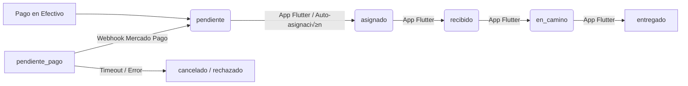

# 🌟 Estrella Delivery — Arquitectura del Sistema
> Documento vivo para desarrolladores. Última actualización: julio 2026.

-## Tabla de Contenidos
1. [Mapa del sistema](#1-mapa-del-sistema)
2. [Repositorios, Apps y Dónde Buscar](#2-repositorios-apps-y-dónde-buscar)
3. [Base de datos (Supabase)](#3-base-de-datos-supabase)
4. [Flujo de registro de restaurantes](#4-flujo-de-registro-de-restaurantes)
5. [Sistema de identidad — email canónico](#5-sistema-de-identidad--email-canónico)
6. [Portal B2B — restaurantes-estrella](#6-portal-b2b--restaurantes-estrella)
7. [App cliente — loyalty-estrella (src/)](#7-app-cliente--loyalty-estrella-src)
8. [Bot de WhatsApp — whatsapp-bot](#8-bot-de-whatsapp--whatsapp-bot)
9. [Edge Functions (Supabase)](#9-edge-functions-supabase)
10. [Variables de entorno](#10-variables-de-entorno)
11. [Convenciones y reglas del sistema](#11-convenciones-y-reglas-del-sistema)
12. [Arquitectura de Flujos Asíncronos y Pagos](#12-arquitectura-de-flujos-asíncronos-y-pagos-conekta)
13. [Registro de Correcciones Críticas](#13-registro-de-correcciones-críticas-julio-2026)
14. [Arquitectura de Asignación de Repartidores](#14-arquitectura-de-asignación-de-repartidores-escalable-y-robusta)
15. [Dashboard del Repartidor](#15-dashboard-del-repartidor-flutter-ui)
16. [Seguimiento del Cliente](#16-seguimiento-del-cliente-tracking-whatsapp)

---

## 1. Mapa del sistema

```
┌─────────────────────────────────────────────────────────────────────┐
│                    USUARIOS FINALES                                  │
│                                                                      │
│  📱 Clientes          🍽️ Dueños de Restaurante      👨‍💼 Admin        │
│  (app pública)        (portal B2B web)               (WhatsApp/App)  │
│  🛵 Repartidores      (App Flutter móvil)                            │
└────────┬──────────────────────┬──────────────────────────┬───────────┘
         │                      │                          │
         ▼                      ▼                          ▼
┌─────────────────┐  ┌────────────────────┐  ┌────────────────────────┐
│  App Cliente    │  │  Portal B2B         │  │  WhatsApp Business API │
│  Vite + React   │  │  (restaurantes-     │  │  Meta Cloud API        │
│  /restaurantes  │  │   estrella/)        │  │                        │
│  /loyalty/:tel  │  │  /login, /portal    │  │                        │
│  /pedido/:id    │  │  /menu/:slug        │  │                        │
└────────┬────────┘  └─────────┬──────────┘  └──────────┬─────────────┘
         │                     │                         │
         └──────────────────┬──┘                         │
                            │                            │
                            ▼                            ▼
              ┌─────────────────────────────────────────────────────┐
              │                  SUPABASE                            │
              │                                                      │
              │  PostgreSQL DB  │  Auth  │  Storage  │  Edge Funcs  │
              └──────────────────────────────────────────────────────┘
```

---

## 2. Repositorios, Apps y Dónde Buscar

El proyecto vive en **un solo repositorio monorepo** en `loyalty-estrella/`.
Esta es una guía rápida de **dónde encontrar cada cosa** si necesitas modificar o debugear:

### üåê Frontend Web (Clientes)
- **Directorio:** `src/` (Raíz del proyecto Vite).
- **URL en producción:** `app-estrella.mx`
- **¿Qué hace?** Landing page, directorio de restaurantes, carrito de compras y checkout.
- **¿Dónde buscar?**
  - **Lógica del Carrito y Pago:** `src/pages/PublicMenuView.tsx`
  - **Consulta de Puntos:** `src/pages/ClienteView.tsx`

### 🏪 Portal B2B (Dueños de Restaurantes)
- **Directorio:** `restaurantes-estrella/`
- **URL en producción:** `restaurantes-app-estrella.shop` (o su equivalente mx si aplica).
- **¿Qué hace?** Panel donde los dueños administran su menú (CRUD de platillos, combos) y perfil.
- **¿Dónde buscar?**
  - **Login:** `restaurantes-estrella/src/pages/LoginPage.tsx`
  - **Gestión de Menú:** `restaurantes-estrella/src/pages/MenuProductosView.tsx`

### 📱 App Móvil (Admin & Repartidores)
- **Directorio:** `admin_app/` (Proyecto Flutter)
- **¿Qué hace?** App interna (Android/iOS) usada por los repartidores para aceptar viajes, y por el admin para dar de alta/baja restaurantes, cobrar puntos, y ver mapas.
- **¿Dónde buscar?**
  - **Flujo del Repartidor:** `admin_app/lib/screens/driver_dashboard_screen.dart`
  - **Editor de Mapas y Zonas:** `admin_app/lib/screens/mapa_zonas_screen.dart`

### 🧠 Backend (Edge Functions & WhatsApp)
- **Directorio:** `supabase/functions/`
- **¿Qué hace?** Toda la lógica de negocio, webhooks, notificaciones, y asignación de viajes.
- **¿Dónde buscar?**
  - **Bot de WhatsApp:** `supabase/functions/whatsapp-bot/` (El archivo clave es `button-handler.ts` para respuestas y botones).
  - **Webhook de MercadoPago:** `supabase/functions/mercadopago-webhook/index.ts`
  - **Lógica de Asignación de Repartidores:** `supabase/functions/asignar-repartidor/index.ts`
  - **Envío de Mensajes a WhatsApp:** `supabase/functions/notificar-whatsapp/index.ts`

### Tecnologías principales
- **Frontend Web:** React + TypeScript + Vite + TailwindCSS + Framer Motion.
- **Frontend App:** Flutter + Riverpod.
- **Backend:** Supabase (Postgres + PostGIS + Edge Functions en Deno).
- **Mensajería & Alertas:** WhatsApp Business Cloud API (Meta), Firebase Cloud Messaging (FCM).
- **AI:** OpenAI GPT-4o (en `whatsapp-ai` y `whatsapp-bot/ai.ts`).
îÄ‚îÄ‚îÄ‚îÄ‚îÄ‚îÄ‚îÄ‚îÄ‚îÄ‚îÄ‚îÄ‚îÄ‚îÄ‚îÄ‚îÄ‚îÄ‚îÄ‚îÄ‚îÄ‚îÄ‚îÄ‚îÄ‚îÄ‚îÄ‚îÄ‚îÄ‚îÄ‚îÄ‚îÄ‚îÄ‚îÄ‚îÄ‚îÄ‚îÄ‚îÄ‚îÄ‚îÄ‚îÄ‚îÄ‚îÄ‚îÄ‚îÄ‚îÄ‚îÄ‚îÄ‚îÄ‚îÄ‚îÄ‚îÄ‚îÄ‚îò
```

---

## 2. Repositorios y apps

El proyecto vive en **un solo repositorio monorepo** en `loyalty-estrella/`.

| Directorio | Qué es | URL en producción |
|---|---|---|
| `src/` | App cliente (Vite+React) | `app-estrella.shop` |
| `restaurantes-estrella/` | Portal B2B (Vite+React) | `restaurantes-app-estrella.shop` |
| `supabase/functions/` | Edge Functions (Deno) | `*.supabase.co/functions/v1/*` |
| `admin_app/` | Panel admin interno | local / privado |

### Tecnologías principales
- **Frontend:** React + TypeScript + Vite + TailwindCSS
- **Animaciones:** Framer Motion
- **Backend:** Supabase (Postgres + Auth + Storage + Edge Functions en Deno)
- **Mensajería:** WhatsApp Business Cloud API (Meta)
- **AI:** OpenAI GPT-4o (en `whatsapp-ai` y `whatsapp-bot/ai.ts`)
- **Mapas:** H3 (Uber), KML

---

## 3. Base de datos (Supabase)

### Tablas principales

#### `restaurantes` — La tabla central
```sql
id                    uuid PK
nombre                text
telefono              text UNIQUE     -- 10 dígitos, sin código país
slug                  text UNIQUE     -- slugify(nombre) + "-" + right(tel,4)
admin_id              uuid FK ‚Üí auth.users
activo                boolean         -- el restaurante puede operar
perfil_completo       boolean         -- trigger automático (ver §3.1)
foto_fachada_url      text            -- foto de portada (Storage)
logo_url              text
descripcion_corta     text
correo                text            -- correo de CONTACTO real (≠ email de Auth)
categorias            text[]          -- ej: ['Comida mexicana','Pizzas']
horarios              jsonb           -- { lunes: {abre,cierra,activo}, ... }
hora_apertura         text            -- legacy, usar horarios
hora_cierre           text            -- legacy, usar horarios
programa_lealtad_activo boolean
es_socio              boolean
direccion             text            -- dirección en texto (fallback)
lat                   float           -- ‚úÖ coordenada exacta (fuente de verdad para rutas)
lng                   float           -- ‚úÖ coordenada exacta (fuente de verdad para rutas)
latitud               float           -- alias legacy (mismo propósito que lat)
longitud              float           -- alias legacy (mismo propósito que lng)
maps_url              text            -- link de Google Maps (solo referencia visual)
etiqueta_zona         text            -- 'verde' (n√∫cleo) | 'rojo' (periferia)
```

> **⚠️ REGLA DE UBICACIÓN:** La fuente de verdad para coordenadas son `lat` y `lng`. Se capturan desde la app Flutter (admin_app) mediante un mapa interactivo con pin arrastrable. El campo `maps_url` es solo referencia y NO se usa para cálculos de ruta.
>
> **Jerarquía de fallback para rutas (PublicMenuView.tsx):**
> 1. `lat` + `lng` → Coordenadas exactas (máxima precisión)
> 2. `direccion` → Texto de dirección (geocodificado por Google)
> 3. `nombre + ", México"` → Último recurso
```

> **⚠️ IMPORTANTE:** El campo `correo` aquí es el email real del negocio (para soporte/contacto). El email usado en Supabase Auth es `aliado_${telefono}@app-estrella.shop`. Son distintos. Ver §5.

#### `restaurantes_solicitudes` — Cola de registro pendiente
```sql
id                    uuid PK
nombre_restaurante    text
encargado             text
telefono              text     -- 10 dígitos, sin código país
correo                text     -- email de contacto opcional (NO es el email de Auth)
categoria             text
direccion             text
estado                text     -- 'pendiente' | 'aprobado' | 'rechazado'
creado_en             timestamptz
```

#### `menu_categorias` — Categorías del menú
```sql
id, restaurante_id FK, nombre, emoji, orden, activa
```

#### `menu_items` — Platillos
```sql
id, restaurante_id FK, categoria_id FK, nombre, descripcion,
precio, foto_url, disponible, es_popular, orden,
opciones jsonb  -- [{titulo, requerido, maximo_selecciones, opciones:[{nombre,precio_extra}]}]
```

#### `menu_combos` y `menu_promociones` — Combos y promos
```sql
-- combos: incluye text[] (lista de productos incluidos)
-- promociones: precio_especial, fecha_fin, activa
```

#### `clientes` — Usuarios del programa de lealtad
```sql
id, nombre, telefono, puntos, nivel, reputacion,
referido_por, codigo_referido, creado_en
```

#### `pedidos` — Mandaditos (delivery)
```sql
id, cliente_id FK, repartidor_id FK, restaurante_id FK,
estado, origen, destino, precio, notas, creado_en
```

#### `repartidores`
```sql
id, nombre, alias, telefono, user_id FK ‚Üí auth.users,
activo, zona_actual
```

#### `bot_memory` — Memoria conversacional del bot
```sql
phone    text PK   -- número completo con código país (ej: 529631234567)
history  jsonb     -- array de mensajes [{role, content}]
```

---

### 3.1 Trigger: `perfil_completo`

Un trigger `BEFORE INSERT OR UPDATE` en `restaurantes` eval√∫a autom√°ticamente si el perfil est√° listo para mostrarse en el directorio p√∫blico:

```sql
-- Se activa en: UPDATE restaurantes SET foto_fachada_url = '...'
-- Condición para perfil_completo = TRUE:
--   1. foto_fachada_url IS NOT NULL AND != ''
--   2. categorias IS NOT NULL AND array_length > 0
--   3. Al menos un día activo en horarios

-- Función: check_perfil_completo()
-- Trigger: trg_check_perfil_completo (BEFORE INSERT OR UPDATE)
```

El frontend **no controla** `perfil_completo` directamente. Solo la BD lo sabe.

---

### 3.2 Storage buckets

| Bucket | Uso |
|---|---|
| `menu-fotos` | Fotos de platillos, combos, promos, fachadas de restaurantes |
| `restaurantes` | PDFs de bienvenida para aliados |

Las im√°genes se comprimen a **WebP 80%** antes de subir (ver `subirFoto()` en `restaurantes-estrella/src/lib/supabase.ts`).

---

## 4. Flujo de registro de restaurantes

```
PASO 1 — El dueño del restaurante inicia solicitud
━━━━━━━━━━━━━━━━━━━━━━━━━━━━━━━━━━━━━━━━━━━━━━━━━

  VÍA A: WhatsApp Flow (recomendada)
    whatsapp-flows/index.ts
    ‚Üí payload.accion = "REGISTRO_RESTAURANTE"
    ‚Üí INSERT restaurantes_solicitudes {
        nombre_restaurante, encargado, categoria,
        direccion, telefono (10 dígitos),
        correo: `aliado_${tel10}@app-estrella.shop`  ← email canónico
      }

  VÍA B: Bot conversacional (whatsapp-ai)
    whatsapp-ai/index.ts
    ‚Üí accion = 'REGISTRAR_RESTAURANTE'
    ‚Üí INSERT restaurantes_solicitudes {
        nombre_restaurante, telefono,
        correo: correo_real_del_cliente_o_null  ‚Üê solo de contacto
      }

  En ambas vías → el admin recibe alerta por WA con botones Aprobar/Rechazar


PASO 2 — Admin aprueba
━━━━━━━━━━━━━━━━━━━━━━

  VÍA A: Link HTTP
    admin-approval/index.ts?action=accept&tel=...&secret=...
    → Crea usuario en Supabase Auth con email canónico
    ‚Üí INSERT restaurantes { nombre, telefono, slug, activo:true, ... }
    → Envía credenciales por WA al dueño

  VÍA B: Botón en WhatsApp del admin
    button-handler.ts ‚Üí flow_rest_accept_${tel}
    → Exactamente el mismo proceso que VÍA A


PASO 3 — Dueño entra al portal
━━━━━━━━━━━━━━━━━━━━━━━━━━━━━━

  restaurantes-app-estrella.shop ‚Üí LoginPage
  → Ingresa: teléfono (10 dígitos) + contraseña
  ‚Üí Construye email: `aliado_${phone}@app-estrella.shop`
  ‚Üí supabase.auth.signInWithPassword({ email, password })
  ‚Üí Si OK ‚Üí PortalPage
  ‚Üí getMyRestaurante() ‚Üí restaurantes WHERE admin_id = user.id


PASO 4 — Dueño completa perfil
━━━━━━━━━━━━━━━━━━━━━━━━━━━━━━

  PerfilView.tsx → sube foto de fachada + selecciona categorías + horarios
  ‚Üí UPDATE restaurantes SET foto_fachada_url=..., categorias=..., horarios=...
  ‚Üí Trigger eval√∫a ‚Üí perfil_completo = TRUE
  ‚Üí El restaurante aparece en el directorio p√∫blico (/restaurantes en app cliente)
```

---

## 5. Sistema de identidad — email canónico

> **Regla de oro:** El email de Supabase Auth para dueños de restaurante SIEMPRE es:
> ```
> aliado_${telefono10digitos}@app-estrella.shop
> ```

### ¿Por qué?
- El dueño se identifica naturalmente por su **teléfono de WhatsApp**
- No queremos depender de que el dueño recuerde un correo electrónico
- El login del portal usa teléfono → construye el email internamente → no se expone al usuario

### Archivos que generan este email
| Archivo | Dónde |
|---|---|
| `LoginPage.tsx` | `const email = \`aliado_${phone}@app-estrella.shop\`` |
| `admin-approval/index.ts` | `const authEmail = \`aliado_${tel}@app-estrella.shop\`` |
| `button-handler.ts` | `const authEmail = \`aliado_${restTel}@app-estrella.shop\`` |
| `whatsapp-flows/index.ts` | `correo: \`aliado_${tel10}@app-estrella.shop\`` |

### Repartidores (sistema an√°logo)
Los repartidores usan: `${telefono10}@repartidor.com`  
Creado en `admin-create-user/index.ts`.

---

## 6. Portal B2B — `restaurantes-estrella/`

### Rutas
```
/             ‚Üí PublicLandingPage  (directorio p√∫blico de restaurantes)
/menu/:slug   ‚Üí PublicMenuView     (men√∫ p√∫blico de un restaurante)
/login        → LoginPage          (solo si no hay sesión)
/portal       → PortalPage         (solo si hay sesión activa)
```

### PortalPage — Tabs internas
```
PortalPage
├── DashboardView    — Link al menú digital, QR, estadísticas básicas
├── MenuProductosView — CRUD de platillos (con fotos, categorías, opciones)
├── MenuCombosView   — CRUD de combos
├── MenuPromosView   — CRUD de promociones
└── PerfilView       — Foto de fachada, categorías, horarios, descripción
```

### Lógica del portal
1. Al cargar: `getMyRestaurante()` ‚Üí busca `restaurantes WHERE admin_id = auth.user.id`
2. Si `restaurante == null` ‚Üí pantalla "Acceso pendiente" con link a WhatsApp de soporte
3. Si `restaurante.perfil_completo == false` ‚Üí banner de alerta SOLO en el tab Dashboard
4. Onboarding driver.js: se muestra 1 sola vez por restaurante (`localStorage: onboarding_b2b_done_${restaurante.id}`)
   - Si perfil incompleto ‚Üí el onboarding prioriza el paso de completar perfil
   - Si perfil completo ‚Üí tour normal de todas las secciones

### `PublicMenuView.tsx` — Flujo de Checkout (4 pasos)

El carrito del cliente usa un drawer lateral con 4 pasos secuenciales:

```
Paso 1 — Resumen del pedido
  └─ Lista de productos, cantidades, subtotal

Paso 2 — Datos personales
  └─ Nombre + Teléfono (10 dígitos, validado)
  └─ Avanza SOLO si teléfono es válido

Paso 3 — Entrega + Mapa
  └─ Toggle: 'A domicilio' | 'Recoger en tienda'
  └─ Si domicilio:
       ├─ Botón GPS "Encontrar mi ubicación" (con animación de carga)
       ├─ GoogleMap con `gestureHandling: greedy` (tipo Rappi/Uber)
       ├─ DirectionsService → dibuja ruta. DirectionsRenderer usa `suppressMarkers: true`
       ├─ El pin de ubicación se mantiene exacto sobre el GPS del usuario.
       └─ Se eliminó el input de texto de dirección para evitar fricción. Todo es 100% coordenadas.

Paso 4 — Pago
  └─ Efectivo | En línea (Conekta)

Footer Fijo (Sticky Footer)
  └─ Visible en todos los pasos.
  └─ Muestra en tiempo real el costo de Envío (destacado en color de marca) y el Total a pagar.
```

**Estado persistido en `sessionStorage`:** carrito, nombre, teléfono, tipo entrega, dirección, método pago.

**Librerías clave:**
- `@react-google-maps/api`: `useLoadScript`, `GoogleMap`, `Marker`, `DirectionsService`, `DirectionsRenderer`
- `framer-motion`: animaciones del drawer y transiciones de pasos
- `lucide-react`: iconografía

### Visibilidad p√∫blica (`PublicLandingPage`)
El directorio de restaurantes filtra:
```sql
SELECT * FROM restaurantes
WHERE activo = true AND perfil_completo = true
ORDER BY nombre
```
Un restaurante recién aprobado NO aparece hasta que el dueño completa su perfil.

### `src/lib/supabase.ts` — Interfaz `Restaurante`
La interfaz TypeScript incluye los campos de ubicación:
```ts
export interface Restaurante {
  // ...otros campos
  direccion: string | null
  maps_url?: string | null
  lat?: number | null      // ‚úÖ coordenada exacta
  lng?: number | null      // ‚úÖ coordenada exacta
}
```

---

## 7. App cliente — `loyalty-estrella/src/`

### Rutas (`src/App.tsx`)
```
/                ‚Üí Home           (landing principal de Estrella Delivery)
/cliente         ‚Üí ClienteView    (perfil de cliente, puntos de lealtad)
/loyalty/:tel    → ClienteView    (acceso directo por teléfono)
/restaurantes    ‚Üí RestaurantesPage (directorio de restaurantes)
/restaurantes/:id ‚Üí RestauranteMenuPage (men√∫ de un restaurante)
/pedido/:id      ‚Üí PedidoView     (seguimiento de pedido para repartidores)
/terminos        ‚Üí Terminos
/map-editor      ‚Üí MapEditor      (editor de zonas KML)
/h3-editor       ‚Üí H3MapEditor    (editor de hex√°gonos H3)
```

### Componentes clave
- **FlashBanner:** Banner de promociones que aparece en rutas de cliente
- **SplashScreen:** Pantalla de carga inicial (una vez por sesión)
- **ClienteView:** Tarjeta de lealtad, historial de puntos, código QR personal

---

## 7.5 App Interna Admin — `admin_app/` (Flutter)

Panel de administración móvil para el equipo interno de Estrella Delivery. **No es público.**

### Stack
- **Flutter** + **Riverpod** (state management) + **GoRouter** (navegación)
- **Supabase Dart SDK** para DB y Auth
- **google_maps_flutter** para mapas interactivos
- **geolocator** para GPS del dispositivo

### Pantallas principales (`lib/screens/`)

| Pantalla | Archivo | Qué hace |
|---|---|---|
| Dashboard | `dashboard_screen.dart` | Resumen de pedidos, ingresos, estadísticas |
| Pedidos | `pedidos_screen.dart` | Lista de pedidos con badges por origen (Web/Mandadito/Restaurante) y filtros |
| Detalle Pedido | `pedido_detail_screen.dart` | BottomSheet con info del pedido, cambio de estado |
| Repartidores | `repartidores_screen.dart` | Lista de repartidores activos |
| Detalle Repartidor | `repartidor_detail_screen.dart` | BottomSheet con info y asignaciones |
| Clientes | `clients_screen.dart` | Búsqueda y gestión de clientes VIP |
| Detalle Cliente | `client_detail_screen.dart` | Glassmorphism premium, billetera VIP, QR |
| Configuración | `config_screen.dart` | Gestión de restaurantes, zonas, promos |
| Mapa de Zonas | `mapa_zonas_screen.dart` | Editor visual de zonas de cobertura |
| Scanner | `scanner_screen.dart` | Esc√°ner QR para validar clientes |

### `config_screen.dart` — Configuración de Restaurantes

El sheet `_LocalFormSheet` permite crear y editar restaurantes. Incluye:

```
Campos del formulario:
├─ Nombre del restaurante
├─ Teléfono (10 dígitos)
├─ Ubicación del restaurante (NUEVO flujo):
│   ├─ Badge verde con coords actuales (lat, lng) en tiempo real
│   ├─ Botón "📡 Usar mi ubicación actual" → GPS automático
│   ├─ Botón "🗺️ Seleccionar en mapa" → toggle mapa interactivo
│   └─ GoogleMap (dark style tipo Rappi) 300px con:
│       ├─ Estilo oscuro personalizado (_darkMapStyle)
│       ├─ Pin verde arrastrable (onDragEnd actualiza lat/lng)
│       ├─ onTap → coloca pin al tocar el mapa
│       ├─ onCameraMove → actualiza coords en TIEMPO REAL al mover
│       ├─ gestureRecognizers → captura gestos dentro del ListView
│       └─ Overlay inferior: coordenadas lat/lng en monospace verde
├─ Dirección (texto, opcional)
├─ Etiqueta de zona (verde/rojo)
└─ Toggle Activo/Inactivo
```

**Al guardar:** `lat` y `lng` se escriben directamente en `restaurantes` de Supabase.

**Variables de entorno Flutter:**
```
SUPABASE_URL y SUPABASE_ANON_KEY se inyectan en compile-time via --dart-define
GOOGLE_MAPS_API_KEY se configura en AndroidManifest.xml / AppDelegate.swift
```

---

## 8. Bot de WhatsApp — `whatsapp-bot/`

El bot vive en `supabase/functions/whatsapp-bot/` y es el sistema m√°s complejo del proyecto.

### Archivo de entrada: `index.ts`
Recibe todos los webhooks de WhatsApp y los distribuye:

```
Mensaje entra
    │
    ├── ¿Es botón/lista interactiva? → button-handler.ts

    ├── ¿Es multimedia (imagen/audio)? → media-handler.ts
    ├── ¿Es texto?
    │       ├── ¿Usuario es admin? → admin-handler.ts
    │       ├── ¿Usuario es repartidor? → rep-handler.ts
    │       ├── ¿Usuario es restaurante aliado? → restaurant-b2b-handler.ts
    │       └── ¿Usuario es cliente? → ai.ts (GPT-4o)
    └── ¿Es evento de cron? → cron-handler.ts
```

### Módulos del bot

| Archivo | Responsabilidad |
|---|---|
| `index.ts` | Router principal, identificación de usuario |
| `ai.ts` | Conversación con GPT-4o, memoria, extracción de intenciones |
| `admin-handler.ts` | Comandos de admin: ver pedidos, stats, mensajes masivos |
| `admin-flow.ts` | Flujos de aprobación (VIP, restaurantes) para el admin |
| `button-handler.ts` | Manejo de botones interactivos (aprobaciones, calificaciones) |
| `rep-handler.ts` | Men√∫ y comandos del repartidor |
| `restaurant-b2b-handler.ts` | Cat√°logo de restaurantes, men√∫ para clientes |
| `restaurant-onboarding.ts` | Onboarding por WA para restaurantes recién aprobados |
| `mandadito-handler.ts` | Flujo completo de pedidos delivery (mandaditos) |
| `slash-commands-handler.ts` | Comandos con `/` para el admin |
| `client-flow.ts` | Flujo de registro de clientes VIP |
| `client-profile-handler.ts` | Perfil del cliente, consulta de puntos |
| `cron-handler.ts` | Tareas programadas: recordatorios, reportes diarios |
| `chatwoot-sync.ts` | Sincronización con Chatwoot (CRM) |
| `media-handler.ts` | Procesamiento de im√°genes y audios |
| `db.ts` | Helpers de base de datos comunes al bot |
| `whatsapp.ts` | Funciones de envío de mensajes (texto, imagen, documento, botones) |
| `kml_data.ts` | Datos de zonas de cobertura en formato KML |
| `simulador_criterio.ts` | Simulador del algoritmo de asignación de repartidores |

### Identificación de usuarios
Al recibir un mensaje, el bot identifica al usuario consultando estas tablas en orden:
1. `restaurantes` WHERE telefono = from10 ‚Üí es aliado (`restaurante`)
2. `repartidores` WHERE telefono = from10 ‚Üí es repartidor
3. Hardcoded ADMIN_PHONES env ‚Üí es admin
4. `clientes` WHERE telefono = from10 ‚Üí es cliente registrado
5. Si ninguno ‚Üí es visitante nuevo

### Bot AI (`whatsapp-bot/ai.ts`) — Acciones de ubicación

El system prompt del admin y del repartidor incluye la acción:
```
- UBICACION_RESTAURANTE: Cuando el admin/repartidor pide la ubicación o dirección
  de un restaurante (ej. '¿dónde está X?', 'ubícame el restaurante Y').
  Extrae: restaurante (nombre del restaurante).
  → admin-handler.ts consulta lat/lng en Supabase y envía pin de WhatsApp.
```

---

## 9. Edge Functions (Supabase)

Todas viven en `supabase/functions/` y se despliegan con `supabase functions deploy`.

| Función | Trigger | Qué hace |
|---|---|---|
| `whatsapp-bot` | POST de Meta (webhook) | Bot principal de WhatsApp |
| `whatsapp-ai` | POST de Meta (webhook) | Bot alternativo con AI pura (sin lógica de negocio) |
| `whatsapp-flows` | POST de Meta (webhook) | Procesa respuestas de WhatsApp Flows (formularios nativos) |
| `whatsapp-ventas` | POST de Meta (webhook) | Bot enfocado en ventas/promociones |
| `admin-approval` | GET/POST HTTP | Aprueba o rechaza solicitudes de restaurantes |
| `admin-create-user` | POST HTTP (autenticado) | Crea usuarios repartidores/admin con PIN |
| `auth-otp` | POST HTTP | Autenticación OTP para clientes (sin contraseña) |
| `canjear-puntos` | POST HTTP | Lógica de canje de puntos de lealtad |
| `generar-tarjeta` | POST HTTP | Genera imagen PNG de la tarjeta de lealtad |
| `notificar-whatsapp` | POST HTTP | Envía notificaciones WA programadas |
| `chatwoot-bot` | POST (webhook Chatwoot) | Sincroniza mensajes con el CRM |
| `upload-kml` | POST HTTP | Carga zonas KML al sistema |

### Autenticación de Edge Functions
- **Con `service_role`:** `admin-approval`, `admin-create-user`, `canjear-puntos`, `generar-tarjeta`
- **Con webhook secret de Meta:** `whatsapp-bot`, `whatsapp-ai`, `whatsapp-flows`, `whatsapp-ventas`
- **Con ADMIN_APPROVAL_SECRET:** `admin-approval` vía GET con `?secret=`

---

## 10. Variables de entorno

### Portal B2B (`restaurantes-estrella/.env`)
```env
VITE_SUPABASE_URL=https://xxxx.supabase.co
VITE_SUPABASE_ANON_KEY=eyJ...
```

### App cliente (`loyalty-estrella/.env`)
```env
VITE_SUPABASE_URL=https://xxxx.supabase.co
VITE_SUPABASE_ANON_KEY=eyJ...
```

### Edge Functions (Supabase secrets)
```env
SUPABASE_URL                 # Autoinyectado por Supabase
SUPABASE_SERVICE_ROLE_KEY    # Autoinyectado por Supabase
WHATSAPP_TOKEN               # Token de Meta Business
WHATSAPP_PHONE_ID            # ID del n√∫mero de WA Business
WHATSAPP_VERIFY_TOKEN        # Para verificar webhooks de Meta
ADMIN_PHONES                 # Lista de teléfonos admin separados por coma (ej: 9631234567,9611234567)
ADMIN_APPROVAL_SECRET        # Secret para proteger el endpoint admin-approval
OPENAI_API_KEY               # Para GPT-4o en whatsapp-ai y whatsapp-bot/ai.ts
PDF_BIENVENIDA_URL           # URL p√∫blica del PDF de bienvenida para aliados
```

---

## 11. Convenciones y reglas del sistema

### Teléfonos
- Siempre almacenados como **10 dígitos** sin código de país (ej: `9631234567`)
- Para enviar por API de Meta: `52${tel10}` (ej: `529631234567`)
- Para WhatsApp desde el bot, el n√∫mero entrante (`fromPhone`) ya viene con `521...` ‚Üí se trunca con `.slice(-10)`

### Slugs de restaurantes
- Formato: `slugify(nombre) + "-" + right(telefono, 4)`
- Ejemplo: `"La Taquería Pepe's"` + tel `9631234567` → `la-taqueria-pepes-4567`
- Función `slugify`: convierte a minúsculas, remueve tildes, reemplaza espacios con guiones
- Generado al momento de la aprobación. Una vez creado, **no cambia**.

### Im√°genes
- Siempre se comprimen a **WebP 80%** antes de subir al Storage
- Bucket: `menu-fotos` (p√∫blico)
- Path convention: `restaurantes/{restaurante_id}/foto_fachada.webp`

### `perfil_completo`
- **No modificar manualmente.** Es calculado por el trigger `trg_check_perfil_completo`.
- Solo se vuelve `true` cuando los 3 requisitos están presentes: foto + categorías + horarios.
- Controla si el restaurante aparece en el directorio p√∫blico.

### Bot memory
- La memoria conversacional del bot se guarda en `bot_memory` con la llave = teléfono completo con código de país.
- Se limpia con `DELETE FROM bot_memory WHERE phone = from10` al completar un flujo.
- La memoria de solicitudes pendientes usa `pending_rest_${tel}` como llave especial.

### RPC Functions √∫tiles
```sql
get_user_id_by_email(email_to_search text) ‚Üí uuid
-- Busca un usuario en auth.users por email (requiere service_role)
```

---

## Diagrama de flujo de registro completo

```
Dueño de restaurante (WhatsApp)
          │
          │  "Quiero registrar mi restaurante"
          ▼
  ┌───────────────────┐     ┌──────────────────────┐
  │  whatsapp-flows   │ o   │    whatsapp-ai        │
  │  (Flow nativo WA) │     │  (chat conversacional)│
  └────────┬──────────┘     └──────────┬────────────┘
           │                           │
           └──────────┬────────────────┘
                      │ INSERT restaurantes_solicitudes
                      │ estado = 'pendiente'
                      ▼
           Admin recibe alerta por WA
                      │
          ┌───────────┴────────────┐
          │                        │
          ▼                        ▼
   Botón en WA               Link HTTP
   button-handler.ts         admin-approval/index.ts
   flow_rest_accept_...      ?action=accept&tel=...
          │                        │
          └──────────┬─────────────┘
                     │
                     ├─ createUser en Auth
                     │  email: aliado_${tel}@app-estrella.shop
                     │  password: Estrella${random}*
                     │
                     ├─ INSERT restaurantes
                     │  { nombre, telefono, slug, activo:true,
                     │    perfil_completo:false ← trigger
                     │    programa_lealtad_activo:true }
                     │
                     └─ Envía credenciales por WA:
                        "Usuario: tu teléfono / Clave: Estrella1234*"
                        URL: restaurantes-app-estrella.shop

                     ↓ Dueño entra al portal

             LoginPage ‚Üí phone + password
                     │
                     └─ email: aliado_${phone}@app-estrella.shop
                        supabase.auth.signInWithPassword()
                     │
                     ▼
             PortalPage ‚Üí getMyRestaurante()
                     │
        ┌────────────┴───────────────┐
        │ perfil_completo = false    │ perfil_completo = true
        │ Banner de alerta visible   │ Acceso total al portal
        │ Onboarding guía a PerfilView │ Onboarding tour normal
        └────────────────────────────┘
                     │
             Dueño llena:
             - Foto de fachada
             - Categorías
             - Horarios
                     │
             UPDATE restaurantes ‚Üí trigger eval√∫a
                     │
             perfil_completo = TRUE ‚úÖ
                     │
                     │
             Aparece en /restaurantes (app cliente)
             y en PublicLandingPage (portal)
```

---

## 12. Arquitectura de Flujos Asíncronos y Pagos (Conekta)

El ecosistema opera bajo una arquitectura distribuida orientada a eventos (Event-Driven). Los flujos más críticos dependen de transiciones de estado precisas y del manejo de concurrencia.

### 12.1. Patrón "Fallback" de Doble Vía (Double-Check en Checkout)

Cuando el cliente paga con tarjeta (Conekta), es redirigido a `SuccessPage.tsx`. El reto técnico es saber **cuándo** el webhook de Conekta aprobó el pago en nuestro backend, sin depender de recargas manuales.

Implementamos un mecanismo dual gestionado por referencias de React (`useRef`):
1.  **Vía Primaria (WebSockets):** `supabase.channel('wait-payment')`. Reacciona en milisegundos cuando la Edge Function modifica la base de datos.
2.  **Vía Secundaria (Short-Polling HTTP):** `setInterval` cada 3 segundos como respaldo si los WebSockets son bloqueados por VPNs o fallos de conexión.
3.  **Coordinación (Mutex Local):** Variables como `resolvedRef.current` actúan como semáforos. Quien reciba el estado de `pendiente` primero (Socket o HTTP), bloquea la bandera y mata el proceso competidor (`clearInterval`), asegurando que eventos únicos (como lanzar confeti o borrar el carrito) ocurran exactamente una vez $O(1)$.

### 12.2. Idempotencia en Pagos (Webhook Conekta)

El endpoint de Deno (`conekta-webhook/index.ts`) está diseñado para ser **idempotente**. Conekta puede reenviar el mismo evento `order.paid` múltiples veces debido a latencias de red.

**Implementación de Seguridad:**
El backend aplica un `Guard` explícito a nivel de base de datos usando `UPDATE ... WHERE estado = 'pendiente_pago'`.
Si Conekta envía un evento duplicado, la segunda consulta fallará inofensivamente (devuelve 0 filas afectadas) porque el pedido ya no está en `pendiente_pago`. Esto evita procesamientos dobles y que se envíen múltiples mensajes de WhatsApp al restaurante aliado.

### 12.3. M√°quina de Estados (State Machine)

El ciclo de vida logístico está modelado como una máquina de estados finitos dentro de la columna `estado` de la tabla `pedidos`. Las transiciones están fuertemente acopladas y el frontend (Web) y la App Móvil (Flutter) asumen este flujo unidireccional:


```mermaid
graph LR
    A[pendiente_pago] -->|Webhook Mercado Pago| B(pendiente)
    C[Pago en Efectivo] --> B(pendiente)
    B -->|App Flutter / Auto-asignación| D(asignado)
    D -->|App Flutter| E(recibido)
    E -->|App Flutter| F(en_camino)
    F -->|App Flutter| G[entregado]
    A -->|Timeout / Error| X[cancelado / rechazado]
```

**Regla Estricta:** Las mutaciones a este campo solo se permiten desde entornos autenticados (App de Flutter) o Edge Functions. El RLS (Row Level Security) bloquea activamente intentos de `UPDATE` desde el cliente Web p√∫blico.

---

## 13. Registro de Correcciones Críticas (Julio 2026)

### 13.1. Notificación al Restaurante con Botón Interactivo ("Empezar a Preparar")
El sistema de notificación al restaurante fue modificado para usar **Mensajes Interactivos (Botones) de WhatsApp** en lugar de texto plano.
- **Edge Function (`notificar-whatsapp`):** Se implementó el payload tipo `interactive` de la API de Meta. Cuando se crea una nueva orden, se envía el detalle del pedido, un link al portal B2B (`https://restaurantes-app-estrella.shop/portal`), y un botón de respuesta con el ID `REST_ORDER_PREPARE_{ticket_id}`.
- **Edge Function (`whatsapp-bot`):** El `button-handler.ts` captura el evento `REST_ORDER_PREPARE_`. Extrae el `ticket_id` y actualiza la base de datos (campo `estado_cocina = 'en_cocina'`). Luego dispara `notificar-whatsapp` con tipo `preparando` para avisarle al usuario final.

### 13.2. Error de B√∫squeda UUID vs wb_message_id (Postgres Type Casting)
El `ticket_id` generado por la aplicación web es un string alfanumérico corto de 6 caracteres (`HEPV1G`). Se descubrió un fallo crítico en la consulta a la tabla `pedidos`:
- **Bug:** `supabase.from('pedidos').select('*').or('id.eq.HEPV1G,wb_message_id.eq.HEPV1G')`. Como la columna `id` es un tipo de dato UUID, Postgres crasheaba al intentar castear `HEPV1G` a UUID, abortando toda la consulta (incluso el chequeo por `wb_message_id`).
- **Fix:** Se introdujo validación estática con un Regex (`/^[0-9a-fA-F]{8}-...$/`). Si el id cumple con UUID se busca por `id`, de lo contrario se busca por `wb_message_id`.

### 13.3. Condición de Carrera en el Frontend (Race Condition al Invocar Webhooks)
- **Bug:** En `PublicMenuView.tsx`, cuando se procesaba un pago en Efectivo, se lanzaba la invocación `supabase.functions.invoke('notificar-whatsapp')` sin un comando `await` e inmediatamente el navegador redirigía a `window.location.href = /success`.
- **Efecto:** El navegador Chrome/Safari mataba la conexión `fetch` en vuelo porque la página se descargaba de memoria, por lo que la notificación jamás llegaba al backend de Supabase.
- **Fix:** Se forzó un `await` antes de la redirección para asegurar que la solicitud HTTP se complete y cierre.

### 13.4. Correcciones adicionales (julio 2026)
- ✅ **Bug: Notificación silenciosa en pedidos de "Recoger en tienda" con pago en línea.** El webhook de Mercado Pago tenía una condición `if (tipo_pedido === 'domicilio')` que impedía notificar al restaurante cuando el pago era en línea para recoger en tienda. Corregido eliminando esa condición.
- ‚úÖ **Bug: `__tipo` incorrecto en carrito para combos/promos con opciones.** Al abrir el modal de detalles de un combo/promo y luego elegir opciones, se forzaba `__tipo: 'item'` en lugar de `__tipo: cartItemTipo`. Corregido.
- ✅ **Validación de grupos de opciones vacíos:** Se añadió validación al guardar Platillos, Combos y ahora también Promociones para evitar guardar grupos de opciones sin título o sin opciones internas.
- ⬜ **Aviso "En Cocina":** La columna `estado_cocina` se está actualizando, pero el portal del restaurante debe suscribirse a los cambios (Realtime) para reflejar visualmente que la orden ya fue tomada sin necesidad de recargar la página.
- ⬜ **Seguridad RLS:** Confirmar que las políticas Row Level Security eviten que un restaurante lea o modifique datos de otro. Cada restaurante debe operar estrictamente sobre `restaurante_id = su_propio_id`.
- ⬜ **Limpieza de Logs:** Eliminar `console.log` de depuración en React y Edge Functions antes del paso a producción final.
- ⬜ **SEO y Meta Tags:** Inyectar descripciones SEO dinámicas en la página de cada restaurante.

---

## 14. Arquitectura de Asignación de Repartidores (Escalable y Robusta)

El sistema de despacho (Delivery) ha sido rediseñado para ser completamente autónomo, robusto ante fallas de red y escalable, eliminando la dependencia del cliente web (Frontend) para detonar notificaciones.

### 14.1 Desacoplamiento (Database Webhooks)
Anteriormente, el frontend invocaba la Edge Function `asignar-repartidor`. Esto causaba problemas (condiciones de carrera) si el navegador se cerraba antes de terminar.
**Nuevo flujo:**
1. El frontend web simplemente inserta el pedido en la tabla `pedidos` con estado `pendiente` (Efectivo) o `pendiente_pago` (MercadoPago).
2. Un **Database Webhook (Triggers nativos de Postgres)** escucha inserciones y actualizaciones en la tabla `pedidos`.
3. El webhook dispara silenciosamente la Edge Function `asignar-repartidor` en segundo plano, garantizando 100% de entrega del evento.

### 14.2 Función `asignar-repartidor` (Blindada)
La Edge Function recibe el evento del webhook y opera de manera "Stateless Event-Driven":
- **Validación Estricta:** Ignora redundancias. Si el pedido ya tiene repartidor (`repartidor_id != null`), o no es de tipo `domicilio`, aborta silenciosamente.
- **Geolocalización (PostGIS):** Utiliza la función RPC `buscar_repartidores_cercanos` que aprovecha índices espaciales de PostGIS (`st_distance`) para buscar repartidores en un radio de 5km, descartando a los que tienen batería baja (<15%).
- **Score Híbrido:** El RPC ordena a los candidatos cruzando la distancia con su carga de trabajo (pedidos activos).
- **Comunicación de Doble Vía (Misil FCM + Realtime):**
  1. Envía un evento por WebSockets (`repartidores_ping`) para notificar al instante si el repartidor tiene la app abierta.
  2. Dispara una alerta Push de alta prioridad vía **Firebase Cloud Messaging (FCM) Data-Only**. Esto despierta la app de Flutter en background (incluso si está cerrada) y lanza un `fullScreenIntent` (pantalla completa de llamada entrante) con sonido de sirena.

### 14.3 QStash y Round-Robin (Timeout)
Al asignar, la Edge Function no se queda esperando.
- Agenda una tarea cronométrica exacta usando **Upstash QStash** con un retraso de 15 segundos (`Upstash-Delay: 15s`), pasándole el `pedido_uuid`.
- Cuando pasan los 15s, QStash detona la función `asignacion-timeout`.
- El timeout revisa en la base de datos si el estado del pedido ya es `aceptado`. Si es así, no hace nada (éxito). Si sigue en `pendiente`, significa que el repartidor ignoró el pedido.
- Automáticamente se repite el proceso enviando la notificación al "Siguiente Repartidor" (Turno 2).
- Si nadie acepta, se manda una notificación de WhatsApp de emergencia al Administrador.

---

## 15. Dashboard del Repartidor (Flutter UI)

El `DriverDashboardView` ha sido construido con foco en usabilidad, retención y control operativo:
- **Checklist Inteligente (Pre-Shift):** Antes de poder ponerse "EN LÍNEA", el sistema obliga a superar tres validaciones locales: Batería >15%, GPS activo con permisos "Always", y Volumen multimedia >0 (para asegurar que escuchen la alarma del pedido).
- **Zonas Calientes Simuladas:** Cuando no hay pedidos activos, el mapa renderiza marcadores ambar latiendo aleatoriamente (efecto pulso) simulando demanda (Gamificación).
- **Marcador GPS Din√°mico:** Un marcador azul en el mapa se mueve en tiempo real leyendo `Geolocator.getPositionStream`.
- **UI Inmersiva:** Estilos premium con Glassmorphism y degradados adaptativos para Billetera.

### 15.1 Recuperación de Sesión (Auto-Resume)
- **Hook en Arranque:** Al iniciar el Dashboard, el sistema busca registros de pedidos "huérfanos" asociados al repartidor en estados activos (`asignado`, `en_camino`, `recibido`).
- **Alerta Flotante:** Si existe un pedido en ejecución, se despliega una tarjeta estática alertando al repartidor con un botón de `CONTINUAR PEDIDO` para retomar la operación sin bloqueos, incluso si se cerró la app por accidente.

### 15.2 Botón SOS
Se integró un botón de Emergencia (SOS) que captura las coordenadas GPS exactas en tiempo real y las emite directamente al Administrador mediante Supabase para despacho de asistencia inmediata.

---

## 16. Seguimiento del Cliente (Tracking WhatsApp)
El ciclo del cliente est√° totalmente automatizado mediante WhatsApp (Meta Cloud API).
1. Al crear el pedido, recibe confirmación (plantilla o texto).
2. Cuando el repartidor le da "Aceptar", la base de datos se actualiza.
3. El bot (`notificar-whatsapp`) envía un mensaje interactivo al cliente avisando qué repartidor va en camino.
4. El cliente toca el botón "Rastrear" / "Aceptar".
5. El webhook de WhatsApp captura la respuesta, detecta que hay un pedido activo (`aceptado` o `en_camino`) y responde con un SMS que contiene la URL canónica de seguimiento en vivo (`app-estrella.mx/success?pedido=...`).

