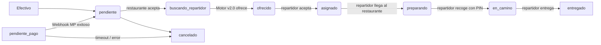

# 🌟 Estrella Delivery — Arquitectura del Sistema v3.0
> Documento vivo para desarrolladores. Última actualización: julio 2026.

## Tabla de Contenidos
0. [🚨 Guía de Supervivencia para Devs](#0-guía-de-supervivencia-para-devs-lee-esto-primero)
1. [Mapa del sistema](#1-mapa-del-sistema)
2. [Repositorios y Apps](#2-repositorios-y-apps)
3. [Base de datos (Supabase)](#3-base-de-datos-supabase)
4. [Flujo de registro de restaurantes](#4-flujo-de-registro-de-restaurantes)
5. [Sistema de identidad — email canónico](#5-sistema-de-identidad--email-canónico)
6. [Portal B2B — restaurantes-estrella](#6-portal-b2b--restaurantes-estrella)
7. [App cliente — loyalty-estrella (src/)](#7-app-cliente--loyalty-estrella-src)
8. [Bot de WhatsApp](#8-bot-de-whatsapp--whatsapp-bot)
9. [Edge Functions (Supabase)](#9-edge-functions-supabase)
10. [Variables de entorno](#10-variables-de-entorno)
11. [Convenciones y reglas del sistema](#11-convenciones-y-reglas-del-sistema)
12. [Arquitectura de Flujos Asíncronos y Pagos](#12-arquitectura-de-flujos-asíncronos-y-pagos)
13. [Registro de Correcciones Críticas](#13-registro-de-correcciones-críticas)
14. [Motor de Asignación de Repartidores v2.0](#14-motor-de-asignación-de-repartidores-v20)
15. [Dashboard del Repartidor](#15-dashboard-del-repartidor-flutter-ui)
16. [Seguimiento del Cliente (Tracking)](#16-seguimiento-del-cliente-tracking-whatsapp)

---

## 0. 🚨 Guía de Supervivencia para Devs (Lee esto primero)

> Si acabas de llegar al proyecto o vas a hacer un cambio, **lee esta sección completa antes de tocar código.** Aquí están los errores que ya rompieron producción antes y las reglas que los evitan.

---

### 0.1 Las Reglas de Oro (NUNCA violar)

#### ❌ NUNCA llames a `asignar-repartidor` desde el frontend
Esta es la regla más importante del sistema. La función de asignación de repartidores **solo** es disparada por la Base de Datos (Trigger de PostgreSQL). Si agregas un `fetch`, `supabase.functions.invoke` o cualquier llamada manual a `asignar-repartidor` desde cualquier frontend (React, Flutter, etc.), **romperás la asignación** porque el pedido se procesará dos veces al mismo tiempo, causando race conditions que bloquean al repartidor durante 10-30 segundos.

```
✅ CORRECTO: La BD actualiza 'estado = buscando_repartidor' → Trigger → asignar-repartidor
❌ INCORRECTO: frontend.fetch('asignar-repartidor') + BD actualiza estado (doble disparo)
```

#### ❌ NUNCA cambies el estado de un pedido a uno anterior
Los estados de `pedidos.estado` son **estrictamente unidireccionales**. El trigger `trg_validar_flujo_pedido` lo rechazará a nivel de BD, pero si haces un bypass en producción, romperás la lógica de facturación, las notificaciones y las métricas de los repartidores.

```
✅ pendiente → buscando_repartidor → ofrecido → asignado → en_camino → entregado
❌ en_camino → pendiente   (prohibido)
❌ asignado → buscando_repartidor  (prohibido)
```

#### ❌ NUNCA muestres pedidos `pendiente_pago` en la UI operativa
Los pedidos en estado `pendiente_pago` son **carritos abandonados**. No tienen pago confirmado. Mostrarlos en el Kanban del Admin o en las estadísticas confunde al equipo de soporte haciéndolos pensar que hay pedidos reales. Siempre filtra: `.neq('estado', 'pendiente_pago')`.

#### ❌ NUNCA construyas el email de usuario manualmente en páginas públicas
El email de Auth sigue un patrón estricto:
- Restaurantes: `aliado_${telefono10}@app-estrella.shop`
- Repartidores: `${telefono10}@repartidor.com`

Si cambias este patrón en un lugar pero no en todos, los usuarios no podrán iniciar sesión.

#### ❌ NUNCA uses `maps_url` para cálculos de ruta o distancia
El campo `maps_url` en la tabla `restaurantes` es **solo un link de referencia visual** (para mostrar un botón "Ver en Maps"). Para todo cálculo de ruta, distancia o coordenadas, usa `lat` y `lng`.

---

### 0.2 Qué puedes tocar con confianza

| Área | Archivos | Riesgo |
|---|---|---|
| UI del portal B2B | `restaurantes-estrella/src/pages/views/*.tsx` | 🟢 Bajo |
| UI del admin web | `admin-web/src/pages/*.tsx`, `admin-web/src/components/` | 🟢 Bajo |
| Menú y catálogo | `MenuProductosView`, `MenuCombosView`, `MenuPromosView` | 🟢 Bajo |
| Estilos y diseño | `*.css`, clases Tailwind | 🟢 Bajo |
| Bot de WhatsApp | `whatsapp-bot/index.ts` (respuestas de texto) | 🟡 Medio |
| Edge Functions auxiliares | `notificar-whatsapp`, `canjear-puntos` | 🟡 Medio |
| Lógica de pagos | `mercadopago-checkout`, `mercadopago-webhook` | 🔴 Alto |
| Motor de asignación | `asignar-repartidor`, `asignacion-timeout` | 🔴 Alto |
| Triggers de PostgreSQL | Supabase Dashboard → Database → Triggers | 🔴 Alto |
| RPC Functions del scoring | `buscar_repartidores_cercanos`, `asignar_pedido_atomico` | 🔴 Alto |

---

### 0.3 Archivos Críticos — No modificar sin entender completamente

```
supabase/functions/asignar-repartidor/index.ts
  └─ Motor de asignación completo. Cualquier cambio aquí afecta
     la entrega de TODOS los pedidos en tiempo real.

supabase/functions/mercadopago-webhook/index.ts
  └─ Si lo rompes, los pagos en línea no se confirmarán y los
     pedidos se quedarán en 'pendiente_pago' para siempre.

supabase/functions/asignacion-timeout/index.ts
  └─ Controla el Round-Robin. Si lo rompes, un repartidor que
     rechace un pedido lo bloqueará para siempre.

restaurantes-estrella/src/pages/views/PedidosView.tsx
  └─ Kanban de cocina del restaurante. Contiene la lógica que
     dispara 'buscando_repartidor'. No agregar llamadas a
     asignar-repartidor aquí.

admin-web/src/pages/Pedidos.tsx
  └─ Torre de Control. Contiene el bloqueo anti-retroceso de estados.
     No agregar llamadas a asignar-repartidor aquí tampoco.
```

---

### 0.4 Antes de desplegar un cambio en Edge Functions

1. **Verifica que no haya llamadas duplicadas** a funciones que la BD ya dispara
2. **Prueba en local** con `npx supabase functions serve`
3. **Despliega con:** `npx supabase functions deploy [nombre] --no-verify-jwt`
4. **Revisa los logs** en: Supabase Dashboard → Edge Functions → [nombre] → Logs
5. **Haz una prueba real** de pedido completo después del deploy

---

### 0.5 Antes de modificar la BD (Supabase Dashboard)

> **⚠️ Nunca ejecutes SQL destructivo en producción sin respaldo.**

| Operación | Acción recomendada |
|---|---|
| Agregar columna | `ALTER TABLE ... ADD COLUMN IF NOT EXISTS` — seguro |
| Eliminar columna | Verificar que ningún código la lea antes |
| Modificar trigger | Primero entender qué Edge Function dispara y por qué |
| `DROP FUNCTION` | Verificar todas las RPC calls en Edge Functions antes |
| Cambiar política RLS | Probar con un usuario de prueba antes de activar |

---

### 0.6 Mapa de Dependencias Críticas

```
Cuando el restaurante presiona "Preparar":
  PedidosView.tsx
    └─ UPDATE pedidos SET estado_cocina='en_cocina', estado='buscando_repartidor'
        └─ [TRIGGER BD: "Asignar Repartidor"]
            └─ POST → asignar-repartidor
                ├─ RPC: buscar_repartidores_cercanos  ← score multi-factor
                ├─ RPC: asignar_pedido_atomico        ← bloqueo atómico
                ├─ UPDATE repartidores SET total_ofertas++
                ├─ UPDATE pedidos SET pickup_pin = '####'
                ├─ Supabase Realtime broadcast
                ├─ FCM Push a repartidor
                └─ QStash delay 15s → asignacion-timeout
                    └─ Si no acepta → incrementar_rechazos → siguiente candidato
                        └─ Si nadie acepta → WhatsApp al admin
```

```
Cuando el cliente paga en línea:
  CartPage.tsx
    └─ INSERT pedidos { estado: 'pendiente_pago' }   ← INVISIBLE en UI
    └─ POST → mercadopago-checkout
        └─ Redirect a MercadoPago
            ├─ ✅ Pago ok → POST mercadopago-webhook
            │   └─ UPDATE pedidos SET estado='pendiente'
            │       └─ [TRIGGER BD: "notificar_cambio"]
            │           └─ POST → notificar-whatsapp
            │               └─ WA al restaurante con botón "Empezar a preparar"
            │
            └─ ❌ Cancelado → returnUrl?error=pago_cancelado
                └─ CartPage.tsx lee el parámetro
                └─ Toast de error, pedido queda en 'pendiente_pago' (invisible)
```

---

### 0.7 Cómo agregar una nueva feature sin romper nada

**Si vas a agregar un nuevo estado a `pedidos.estado`:**
1. Actualiza el trigger `trg_validar_flujo_pedido` en Supabase para permitir la nueva transición
2. Actualiza los filtros en `admin-web/src/pages/Pedidos.tsx` (columnas del Kanban)
3. Actualiza los filtros en `restaurantes-estrella/src/pages/views/PedidosView.tsx`
4. Actualiza el `estadosAvanzados` en el bloqueo anti-retroceso del Kanban
5. Actualiza este documento

**Si vas a agregar una nueva Edge Function:**
1. Créala en `supabase/functions/[nombre]/index.ts`
2. Agrégala al catálogo de §9 de este documento con su estado (`ACTIVO`, `LEGACY`, etc.)
3. Asegúrate de que maneje `OPTIONS` para CORS
4. Despliega con `--no-verify-jwt` si es llamada por la BD o servicios externos

**Si vas a agregar una nueva columna a `repartidores`:**
1. Usa `ADD COLUMN IF NOT EXISTS` para que sea idempotente
2. Si la columna afecta el scoring, actualiza `buscar_repartidores_cercanos` en Supabase
3. Si la app Flutter la necesita, actualiza el modelo `Repartidor` en `driver_app/lib/`

---


## 1. Mapa del sistema

```
┌─────────────────────────────────────────────────────────────────────┐
│                         USUARIOS FINALES                             │
│                                                                      │
│  📱 Clientes          🍽️ Dueños de Restaurante      👨‍💼 Admin Web    │
│  (app pública)        (portal B2B web)               (admin-web/)    │
│  🛵 Repartidores                                                     │
│     (driver_app/)                                                    │
└────────┬──────────────────────┬────────────────────────┬────────────┘
         │                      │                        │
         ▼                      ▼                        ▼
┌─────────────────┐  ┌────────────────────┐  ┌──────────────────────┐
│  App Cliente    │  │  Portal B2B         │  │  Admin Web            │
│  Vite + React   │  │  restaurantes-      │  │  admin-web/           │
│  src/           │  │  estrella/          │  │  Torre de Control     │
└────────┬────────┘  └─────────┬──────────┘  └──────────┬────────────┘
         │                     │                         │
         └──────────────────┬──┘                         │
                            │                            │
                            ▼                            ▼
              ┌─────────────────────────────────────────────────────┐
              │                    SUPABASE                          │
              │                                                      │
              │  PostgreSQL DB  │ Auth │ Storage │ Realtime │ Funcs │
              └─────────────────────────────────────────────────────┘
                            │
                            ▼
              ┌─────────────────────────────────────────────────────┐
              │              SERVICIOS EXTERNOS                      │
              │                                                      │
              │  📨 WhatsApp (Meta)  │ 🗺️ Google Maps  │ 🔥 FCM     │
              │  💳 MercadoPago      │ 🕐 Upstash QStash             │
              └─────────────────────────────────────────────────────┘
```

---

## 2. Repositorios y Apps

El proyecto vive en **un solo repositorio monorepo** en `loyalty-estrella/`.

| Directorio | Qué es | URL en producción |
|---|---|---|
| `src/` | App cliente (Vite+React) | `app-estrella.shop` |
| `restaurantes-estrella/` | Portal B2B (Vite+React) | `restaurantes-app-estrella.shop` |
| `admin-web/` | Panel de administración web (React) | privado / interno |
| `supabase/functions/` | Edge Functions (Deno) | `*.supabase.co/functions/v1/*` |
| `admin_app/` | Panel admin interno (Flutter) | local / privado |
| `driver_app/` | Dashboard Repartidor (Flutter) | app store |

### Tecnologías principales
- **Frontend:** React + TypeScript + Vite + TailwindCSS
- **Animaciones:** Framer Motion, `@dnd-kit` (Kanban)
- **Backend:** Supabase (Postgres + Auth + Storage + Edge Functions en Deno)
- **Mensajería:** WhatsApp Business Cloud API (Meta)
- **Push Notifications:** Firebase Cloud Messaging (FCM) — Data-Only
- **Cola de tareas asíncronas:** Upstash QStash
- **Mapas:** Google Maps API, PostGIS (Supabase), H3 (Uber), KML
- **AI:** OpenAI GPT-4o (`whatsapp-ai`, `whatsapp-bot/ai.ts`)
- **Pagos:** MercadoPago (principal), Conekta (legacy)

---

## 3. Base de datos (Supabase)

### Tablas principales

#### `restaurantes` — La tabla central
```sql
id                    uuid PK
nombre                text
telefono              text UNIQUE     -- 10 dígitos, sin código país
slug                  text UNIQUE     -- slugify(nombre) + "-" + right(tel,4)
admin_id              uuid FK → auth.users
activo                boolean
perfil_completo       boolean         -- trigger automático (ver §3.1)
foto_fachada_url      text
logo_url              text
descripcion_corta     text
correo                text            -- correo de CONTACTO real (≠ email de Auth)
categorias            text[]
horarios              jsonb
lat                   float           -- ✅ coordenada exacta (fuente de verdad)
lng                   float           -- ✅ coordenada exacta (fuente de verdad)
etiqueta_zona         text            -- 'verde' | 'rojo'
```

> **⚠️ REGLA DE UBICACIÓN:** La fuente de verdad son `lat` y `lng`. El campo `maps_url` es solo referencia y NO se usa para cálculos de ruta.

#### `pedidos` — La tabla de operaciones central
```sql
id                        uuid PK
wb_message_id             text            -- ID corto legible (ej: HEPV1G)
cliente_nombre            text
cliente_telefono          text
restaurante               text
restaurante_id            uuid FK → restaurantes
repartidor_id             uuid FK → repartidores(user_id)
estado                    text            -- máquina de estados (ver §12.3)
estado_cocina             text            -- 'pendiente' | 'en_cocina' | 'listo_para_recoger'
tipo_pedido               text            -- 'domicilio' | 'recoger'
metodo_pago               text            -- 'efectivo' | 'en_linea'
total                     numeric
lat                       float           -- coordenadas del RESTAURANTE
lng                       float
lat_entrega               float           -- coordenadas del CLIENTE
lng_entrega               float
pickup_pin                text            -- PIN de 4 dígitos Restaurante↔Repartidor
tiempo_preparacion_minutos int
created_at                timestamptz
updated_at                timestamptz
```

**Estados válidos de `estado` (máquina de estados unidireccional):**
```
pendiente_pago → pendiente → buscando_repartidor → ofrecido → asignado
→ preparando → en_camino → entregado
                                                              → cancelado
```

> **⚠️ REGLA CRÍTICA:** Los pedidos `pendiente_pago` son "carritos abandonados" y **nunca** deben mostrarse en el Kanban del Admin ni en las estadísticas. Son invisibles operativamente hasta que se completa el pago.

#### `repartidores` — Flota de entrega
```sql
id                            uuid PK
user_id                       uuid UNIQUE FK → auth.users
nombre                        text
alias                         text
telefono                      text
activo                        boolean         -- ¿está en turno?
lat                           float           -- GPS en tiempo real
lng                           float
bateria                       integer         -- % batería del celular
meta_envios                   integer         -- pedidos objetivo del turno
-- ✅ NUEVAS COLUMNAS (Motor v2.0 - julio 2026):
total_ofertas                 integer DEFAULT 0  -- cuántas veces se le ofreció un pedido
total_aceptaciones            integer DEFAULT 0  -- cuántas veces aceptó
ultimo_pedido_entregado_at    timestamptz        -- para cálculo de fairness / turno
```

#### `clientes` — Usuarios del programa de lealtad
```sql
id, nombre, telefono, puntos, nivel, reputacion,
referido_por, codigo_referido, creado_en
```

#### `bot_memory` — Memoria conversacional del bot
```sql
phone    text PK   -- número completo con código país (ej: 529631234567)
history  jsonb     -- array de mensajes [{role, content}]
```

---

### 3.1 Triggers de PostgreSQL

| Trigger | Tabla | Evento | Acción |
|---|---|---|---|
| `trg_check_perfil_completo` | `restaurantes` | BEFORE INSERT OR UPDATE | Calcula `perfil_completo` automáticamente |
| `trg_validar_flujo_pedido` | `pedidos` | BEFORE UPDATE | Valida que los estados avancen en la dirección correcta |
| `trg_prevent_estado_cocina_rollback` | `pedidos` | BEFORE UPDATE | Impide revertir `estado_cocina` a un estado anterior |
| `trg_update_estado_pedido` | `pedidos` | AFTER UPDATE | Propaga cambios de estado a sistemas externos |
| `trg_driver_delivery_stats` | `pedidos` | AFTER UPDATE | Al marcar `entregado`, actualiza `ultimo_pedido_entregado_at` del repartidor |
| **`Asignar Repartidor`** | `pedidos` | AFTER INSERT / UPDATE | Dispara Edge Function `asignar-repartidor` vía HTTP |

> **⚠️ EL WEBHOOK MÁS CRÍTICO:** El trigger `Asignar Repartidor` es la pieza que mantiene todo desacoplado. El frontend NUNCA debe llamar manualmente a `asignar-repartidor`. La BD lo hace sola.

### 3.2 RPC Functions clave

| Función | Descripción |
|---|---|
| `buscar_repartidores_cercanos(lat, lng, radio, ...)` | **v2.0:** Score multi-factor: distancia + carga + tasa_aceptacion + fairness. Hard cap: 3 pedidos activos |
| `asignar_pedido_atomico(pedido_id, repartidor_id)` | Bloqueo atómico para prevenir race conditions. Incrementa `total_aceptaciones` al aceptar |
| `aceptar_pedido_atomico(pedido_id, repartidor_id)` | Acepta el pedido + incrementa `total_aceptaciones` |
| `incrementar_rechazos(repartidor_id)` | Incrementa contador de rechazos |
| `calcular_eta_dinamico(...)` | ETA dinámico basado en condiciones actuales |
| `monitor_pedidos_zombies()` | Detecta pedidos huérfanos sin asignación |
| `fn_registrar_entrega(...)` | Registra entrega completada |
| `get_user_id_by_email(email)` | Busca usuario en auth.users (requiere service_role) |

### 3.3 Storage buckets

| Bucket | Uso |
|---|---|
| `menu-fotos` | Fotos de platillos, combos, promos, fachadas |
| `restaurantes` | PDFs de bienvenida para aliados |

Las imágenes se comprimen a **WebP 80%** antes de subir (ver `subirFoto()` en `restaurantes-estrella/src/lib/supabase.ts`).

---

## 4. Flujo de registro de restaurantes

```
PASO 1 — El dueño del restaurante inicia solicitud
  VÍA A: WhatsApp Flow → whatsapp-flows/index.ts
  VÍA B: Bot conversacional → whatsapp-ai/index.ts
  → INSERT restaurantes_solicitudes { estado: 'pendiente' }
  → Admin recibe alerta por WA con botones Aprobar/Rechazar

PASO 2 — Admin aprueba
  → Crea usuario en Supabase Auth (email canónico)
  → INSERT restaurantes { activo:true, perfil_completo:false }
  → Envía credenciales por WA al dueño

PASO 3 — Dueño entra al portal
  restaurantes-app-estrella.shop/login
  → Teléfono + contraseña → email: aliado_${phone}@app-estrella.shop
  → supabase.auth.signInWithPassword()

PASO 4 — Dueño completa perfil
  → Sube foto + categorías + horarios
  → Trigger evalúa → perfil_completo = TRUE
  → Aparece en el directorio público
```

---

## 5. Sistema de identidad — email canónico

> **Regla de oro:** El email de Auth para dueños de restaurante SIEMPRE es:
> ```
> aliado_${telefono10digitos}@app-estrella.shop
> ```
> Los repartidores usan: `${telefono10}@repartidor.com`

---

## 6. Portal B2B — `restaurantes-estrella/`

### Rutas
```
/             → PublicLandingPage  (directorio público de restaurantes)
/menu/:slug   → PublicMenuView     (menú público de un restaurante)
/login        → LoginPage
/portal       → PortalPage (requiere sesión)
```

### PortalPage — Tabs internas
```
PortalPage
├── DashboardView      — Link al menú, QR, estadísticas básicas
├── PedidosView        — ✅ Kanban de cocina: Nuevos → En Cocina → Listos
│                         Notificaciones push + alarma sonora
├── MenuProductosView  — CRUD de platillos (con fotos, categorías, opciones)
├── MenuCombosView     — CRUD de combos
├── MenuPromosView     — CRUD de promociones
└── PerfilView         — Foto de fachada, categorías, horarios, descripción
```

### PedidosView — Kanban de Cocina (Portal B2B)

El portal del restaurante tiene su propio Kanban de 3 columnas para gestión de cocina:

```
NUEVOS          EN COCINA          LISTOS PARA RECOGER
(pendiente)     (en_cocina)        (listo_para_recoger)
    │               │                      │
    ▼               ▼                      ▼
[Preparar]      [¡Listo!]          (repartidor lo recoge
    │               │               con PIN de 4 dígitos)
    ▼               ▼
estado_cocina:  estado_cocina:
'en_cocina'    'listo_para_recoger'
    +               
estado: 'buscando_repartidor'
(Motor v2.0 inicia búsqueda)
```

**Reglas de negocio del Kanban de Cocina:**
- Los pedidos `pendiente_pago` (carritos abandonados) están **completamente ocultos**
- Al presionar "Preparar": `estado_cocina = 'en_cocina'` + `estado = 'buscando_repartidor'`
- El Webhook de BD detecta el UPDATE y dispara `asignar-repartidor` automáticamente
- **El portal NO llama a `asignar-repartidor` directamente** (eliminado en julio 2026)

### Flujo de Checkout del cliente (PublicMenuView)

```
Paso 1 → Resumen del pedido
Paso 2 → Datos personales (nombre + teléfono)
Paso 3 → Entrega (domicilio con mapa GPS | recoger en tienda)
Paso 4 → Pago (Efectivo | En línea con MercadoPago)
```

**Pago en línea (MercadoPago):**
- Se crea el pedido con `estado = 'pendiente_pago'`
- Se redirige a MercadoPago con `returnUrl` para manejar cancelaciones
- Si el usuario cancela, regresa al carrito con toast de error `?error=pago_cancelado`
- Si paga exitosamente, el Webhook de MP cambia el estado a `pendiente` y dispara notificaciones

---

## 7. App cliente — `loyalty-estrella/src/`

### Rutas (`src/App.tsx`)
```
/                → Home (landing principal)
/cliente         → ClienteView (perfil, puntos de lealtad)
/loyalty/:tel    → ClienteView (acceso directo por teléfono)
/restaurantes    → RestaurantesPage (directorio)
/restaurantes/:id → RestauranteMenuPage (menú de un restaurante)
/pedido/:id      → PedidoView (seguimiento en vivo)
/terminos        → Terminos
/map-editor      → MapEditor (editor zonas KML)
/h3-editor       → H3MapEditor
```

### CartPage — Gestión de pagos fallidos
- Lee el parámetro `?error=pago_cancelado` de la URL al regresar de MercadoPago
- Muestra un toast de error y limpia la URL para no persistir el mensaje en refresh
- El carrito se mantiene completo para que el usuario pueda reintentar

---

## 8. Bot de WhatsApp — `whatsapp-bot`

El bot tiene lógica modular en:
- `index.ts` — Router principal
- `button-handler.ts` — Botones interactivos de WA
- `ai.ts` — Contexto GPT-4o

**Flujos activos:**
- Registro de restaurantes
- Consulta de pedidos
- Confirmación de órdenes
- Respuesta a clientes sobre estado de entrega

---

## 9. Edge Functions (Supabase)

### Catálogo completo

| Función | Estado | Propósito |
|---|---|---|
| `asignar-repartidor` | ✅ **ACTIVO (v2.0)** | Motor inteligente de asignación. Score multi-factor. |
| `asignacion-timeout` | ✅ ACTIVO | Si el repartidor no acepta en 15s, rota al siguiente candidato (vía QStash) |
| `notificar-whatsapp` | ✅ ACTIVO | Envía mensajes WA al restaurante y cliente al cambiar estados |
| `mercadopago-checkout` | ✅ ACTIVO | Crea preferencia de pago en MP y retorna init_point |
| `mercadopago-webhook` | ✅ ACTIVO | Recibe confirmación de pago de MP. Cambia estado a `pendiente` |
| `mercadopago-oauth-callback` | ✅ ACTIVO | OAuth para onboarding de restaurantes con MP |
| `mercadopago-onboarding` | ✅ ACTIVO | Flujo de alta de restaurante en MP |
| `send-fcm` | ✅ ACTIVO | Envía push FCM al repartidor (asignación manual desde admin-web) |
| `whatsapp-bot` | ✅ ACTIVO | Bot principal de WhatsApp |
| `whatsapp-ai` | ✅ ACTIVO | Bot con IA (GPT-4o) para consultas complejas |
| `whatsapp-flows` | ✅ ACTIVO | Flujos nativos de WhatsApp (registro de restaurantes) |
| `whatsapp-ventas` | ✅ ACTIVO | Notificaciones de ventas |
| `admin-approval` | ✅ ACTIVO | Aprobación de solicitudes de restaurantes |
| `admin-create-user` | ✅ ACTIVO | Creación de usuarios (repartidores, admins) |
| `auth-otp` | ✅ ACTIVO | OTP para autenticación |
| `canjear-puntos` | ✅ ACTIVO | Canje de puntos de lealtad |
| `cron-rescate` | ✅ ACTIVO | Cron job: rescata pedidos zombies sin repartidor |
| `chatwoot-bot` | ✅ ACTIVO | Integración con Chatwoot CRM |
| `chatwoot-test` | 🧪 TEST | Función de prueba para Chatwoot |
| `conekta-checkout` | ⚠️ LEGACY | Checkout con Conekta (reemplazado por MercadoPago) |
| `conekta-webhook` | ⚠️ LEGACY | Webhook de Conekta (reemplazado por MercadoPago) |
| `get-route` | ✅ ACTIVO | Calcula ruta entre dos puntos (Google Maps Directions) |
| `upload-kml` | ✅ ACTIVO | Procesa archivos KML de zonas geográficas |
| `stripe-checkout` | ⚠️ NO USADO | Checkout Stripe (nunca se activó en producción) |
| `stripe-onboarding` | ⚠️ NO USADO | Onboarding Stripe (nunca se activó en producción) |

> **⚠️ LIMPIEZA PENDIENTE:** Las funciones `stripe-checkout`, `stripe-onboarding` y las de Conekta pueden archivarse si no se planea reactivarlas.

### `asignar-repartidor` v2.0 — Motor inteligente

**Flujo completo:**
```
Webhook de BD (trigger) → POST asignar-repartidor
        │
        ├─ Guarda de idempotencia: aborta si estado ≠ 'buscando_repartidor'
        │
        ├─ RPC: buscar_repartidores_cercanos (5km radio)
        │   └─ Score multi-factor (menor = mejor):
        │       40% → Distancia al restaurante
        │       25% → Pedidos activos (hard cap: 3 simultáneos)
        │       25% → Tasa de aceptación histórica
        │       10% → Minutos sin recibir un pedido (fairness)
        │       Bonus → Nivel de batería
        │
        ├─ Filtros adicionales:
        │   ├─ Excluir al que tiene un 'ofrecido' sonando (anti-stacking)
        │   └─ Excluir al que acaba de rechazar (zero-wait)
        │
        ├─ Refinamiento Google Maps API (solo Top 5 candidatos)
        │   └─ Reemplaza distancia lineal con ETA real de tráfico
        │
        ├─ Asignación atómica al #1 (RPC: asignar_pedido_atomico)
        │   └─ Si falla (race condition): aborta limpio
        │
        ├─ Actualizar métricas: total_ofertas++ para el repartidor elegido
        │
        ├─ Generar PIN de 4 dígitos (Restaurante ↔ Repartidor)
        │
        ├─ Notificar al repartidor:
        │   ├─ Realtime Broadcast (app en primer plano)
        │   └─ FCM Data-Only Push (app en background/cerrada)
        │
        └─ QStash: programar timeout de 15s → asignacion-timeout
            └─ Si no acepta → rota al 2do candidato
            └─ Si nadie acepta → WhatsApp de emergencia al admin
```

**Métricas que se actualizan automáticamente:**
- `total_ofertas++` → al ofrecer el pedido (en `asignar-repartidor`)
- `total_aceptaciones++` → al aceptar (en `aceptar_pedido_atomico`)
- `ultimo_pedido_entregado_at = NOW()` → al entregar (trigger `trg_driver_delivery_stats`)

---

## 10. Variables de entorno

| Variable | Usada en | Descripción |
|---|---|---|
| `SUPABASE_URL` | Todas | URL del proyecto Supabase |
| `SUPABASE_SERVICE_ROLE_KEY` | Edge Functions | Llave de servicio (bypass RLS) |
| `SUPABASE_ANON_KEY` | Frontends | Llave pública |
| `WHATSAPP_TOKEN` | whatsapp-* | Token de acceso Meta |
| `WHATSAPP_PHONE_ID` | whatsapp-* | ID del número de teléfono WA |
| `ADMIN_PHONES` | asignar-repartidor, etc. | Teléfonos del admin (CSV) |
| `GOOGLE_MAPS_KEY` | asignar-repartidor, get-route | API Key de Google Maps |
| `FIREBASE_SERVICE_ACCOUNT` | asignar-repartidor, send-fcm | Service Account de Firebase (JSON) |
| `QSTASH_TOKEN` | asignar-repartidor, asignacion-timeout | Token de Upstash QStash |
| `MP_ACCESS_TOKEN` | mercadopago-* | Token de MercadoPago |
| `OPENAI_API_KEY` | whatsapp-ai | API Key de OpenAI |

---

## 11. Convenciones y reglas del sistema

### Reglas de estado de pedidos (NO violar)
1. **`pendiente_pago`** → Carrito abandonado. **Invisible** en el Admin Kanban y estadísticas.
2. **Avance unidireccional:** Los estados solo avanzan. Nunca regresan.
3. **Bloqueo anti-retroceso (Admin Web):** Si un pedido está en `buscando_repartidor`, `ofrecido`, `asignado`, `preparando`, `en_camino` o `entregado`, es **imposible** arrastrarlo de vuelta a columnas de cocina en el Kanban.
4. **Un solo disparador:** `asignar-repartidor` solo es llamado por el Trigger de BD. Ni el portal del restaurante ni el admin web lo llaman directamente.

### Reglas de identidad
- Dueños de restaurante: `aliado_${tel}@app-estrella.shop`
- Repartidores: `${tel}@repartidor.com`
- El login siempre usa el teléfono, el email se construye internamente.

### Reglas de ubicación
- La fuente de verdad para coordenadas son `lat` y `lng` (nunca `maps_url`)
- Los pedidos guardan coordenadas tanto del restaurante como del cliente

### Imágenes
- Siempre WebP 80% antes de subir al Storage
- Bucket: `menu-fotos` (público)

---

## 12. Arquitectura de Flujos Asíncronos y Pagos

### 12.1 Pago en Línea (MercadoPago)

```
Cliente elige "Pagar en línea"
        │
        ├─ CartPage llama a mercadopago-checkout
        │   └─ Payload incluye returnUrl (para manejar cancelaciones)
        │
        ├─ Se crea pedido con estado = 'pendiente_pago'
        │
        ├─ Cliente es redirigido a MercadoPago
        │
        ├─ ✅ Pago exitoso:
        │   mercadopago-webhook recibe confirmación
        │   UPDATE pedidos SET estado = 'pendiente' WHERE estado = 'pendiente_pago'
        │   → Trigger dispara notificación al restaurante por WA
        │   → Pedido aparece en Kanban del Admin
        │
        └─ ❌ Pago cancelado:
            MP redirige a returnUrl?status=failure&error=pago_cancelado
            CartPage lee el parámetro, muestra toast de error
            El pedido permanece en 'pendiente_pago' (invisible / carrito abandonado)
```

### 12.2 Idempotencia en Webhooks

Todos los webhooks están diseñados para ser **idempotentes**. Si MP o Conekta reenvían el mismo evento, el `UPDATE ... WHERE estado = 'pendiente_pago'` falla silenciosamente (0 filas afectadas). Esto evita duplicar notificaciones.

### 12.3 Máquina de Estados de `pedidos`



**Regla estricta de transiciones:** El trigger `trg_validar_flujo_pedido` rechaza cualquier cambio que no siga este orden.

### 12.4 Admin Web — Torre de Control

```
admin-web/src/pages/Pedidos.tsx — Kanban Drag & Drop
├── Columna: Recibidos/Nuevos    (estado: 'pendiente')
├── Columna: Buscando Repartidor (estado: 'buscando_repartidor' | 'ofrecido')
│   └─ Tarjeta con animación pulsante:
│       🟡 "BUSCANDO REPARTIDOR..." (buscando_repartidor)
│       🔵 "ESPERANDO RESPUESTA..." (ofrecido - repartidor decidiendo)
├── Columna: En Camino           (estado: 'asignado' | 'preparando' | 'en_camino')
└── Sidebar: Flota de Repartidores (drag target para asignación manual)

Reglas de negocio en el Kanban:
- No se puede arrastrar a estados anteriores (bloqueo anti-retroceso)
- La tarjeta permanece en "Buscando" hasta que el repartidor acepta
- La animación desaparece sola cuando el estado cambia a 'asignado'
```

---

## 13. Registro de Correcciones Críticas

### 13.1 Eliminación del Doble Disparo (julio 2026) ✅
**Bug:** Tanto el Portal del Restaurante (`PedidosView.tsx`) como el Admin Web (`Pedidos.tsx`) llamaban manualmente a `asignar-repartidor` via `fetch`/`invoke`, además del Trigger de BD. Esto causaba que la función se ejecutara 2 veces en el mismo milisegundo, provocando:
- El repartidor veía "el viaje ya está ocupado"
- El sistema esperaba 30 segundos para reintentar

**Fix:** Se eliminaron todas las llamadas manuales desde el frontend. Solo la BD dispara `asignar-repartidor`.

### 13.2 Notificación al Restaurante con Botón Interactivo ✅
El sistema usa **Mensajes Interactivos (Botones) de WhatsApp** en lugar de texto plano. El botón `REST_ORDER_PREPARE_{ticket_id}` es capturado por `button-handler.ts` para marcar la orden en cocina.

### 13.3 Bug UUID vs wb_message_id ✅
**Fix:** Validación con Regex antes de construir la query. Si el ID cumple UUID → busca por `id`, si no → busca por `wb_message_id`.

### 13.4 Race Condition en Checkout (Pago Efectivo) ✅
**Fix:** Se forzó `await` antes de `window.location.href` para que el fetch de `notificar-whatsapp` complete antes de que el navegador descargue la página.

### 13.5 Pedidos pendiente_pago visibles en Admin (julio 2026) ✅
**Fix:** Se filtran en el Kanban, la lista y las estadísticas del Dashboard para que los carritos abandonados sean completamente invisibles operativamente.

### 13.6 Pago en línea + retorno al cliente (julio 2026) ✅
**Fix:** `mercadopago-checkout` ahora acepta `returnUrl` y lo usa como `back_urls.failure`/`back_urls.pending`. `CartPage` lee `?error=pago_cancelado` y muestra toast de error.

### 13.7 Motor de Asignación v2.0 (julio 2026) ✅
Reemplazó el motor anterior con score multi-factor (ver §14).

### Pendientes ⬜
- Limpieza de funciones Stripe (nunca usadas en producción)
- Archivado de `chatwoot-test` (función de testing)
- Limpieza de `console.log` de depuración antes de release final
- SEO dinámico en páginas de restaurante

---

## 14. Motor de Asignación de Repartidores v2.0

### 14.1 Principio de Desacoplamiento Total
El frontend **nunca** dispara la asignación. Solo la Base de Datos lo hace mediante Triggers nativos de PostgreSQL. Esto garantiza que aunque el navegador se cierre, caiga la conexión o falle el frontend, la lógica de asignación siempre se ejecuta.

### 14.2 Score Multi-Factor (RPC: `buscar_repartidores_cercanos`)

```sql
-- Score (menor = mejor):
score = 
  (distancia_metros * 0.40)           -- 40%: Proximidad al restaurante
  + (pedidos_activos * 2500)          -- 25%: Carga de trabajo
  - (tasa_aceptacion * 3000)          -- 25%: Historial de aceptación
  - (minutos_sin_pedido * 5.0)        -- 10%: Fairness / turno
  - (bateria * 8.0)                   -- Bonus: Batería

-- Hard caps:
WHERE pedidos_activos_count < 3       -- Máx. 3 pedidos simultáneos
AND bateria >= 15                     -- Mínimo 15% de batería
AND activo = true
LIMIT 10;                             -- Máx. 10 candidatos
```

**Dónde se obtiene cada factor:**
| Factor | Fuente |
|---|---|
| Distancia | PostGIS `ST_DistanceSphere` (refinado con Google Maps para Top 5) |
| Pedidos activos | `COUNT(pedidos WHERE estado IN ('ofrecido','asignado','preparando','en_camino'))` |
| Tasa de aceptación | `total_aceptaciones / total_ofertas` (columnas en `repartidores`) |
| Minutos sin pedido | `EXTRACT(EPOCH FROM (NOW() - ultimo_pedido_entregado_at)) / 60` |
| Batería | Columna `bateria` en `repartidores` (actualizada por la app Flutter) |

### 14.3 Mecanismo Anti-Concurrencia

```
Problema: Dos pedidos llegan al mismo tiempo y ambos quieren al mismo repartidor.

Solución: asignar_pedido_atomico (RPC con FOR UPDATE SKIP LOCKED)
  → Solo 1 de los 2 procesos logra el UPDATE
  → El otro recibe FALSE y aborta limpio
  → No hay doble asignación ni errores
```

### 14.4 Notificación de Doble Vía

```
Canal 1: Supabase Realtime Broadcast → repartidores_ping
  └─ Latencia: <100ms
  └─ Funciona si la app está en primer plano (foreground)

Canal 2: Firebase Cloud Messaging (FCM Data-Only Push)
  └─ Latencia: ~1-3s
  └─ Despierta la app en background o si está cerrada
  └─ Lanza pantalla completa (fullScreenIntent) con alarma
```

### 14.5 Timeout y Rotación (QStash)

```
asignar-repartidor → QStash delay 15s → asignacion-timeout
        │
        ├─ ¿Pedido ya en estado 'asignado'? → No hacer nada (aceptó)
        │
        └─ ¿Pedido sigue en 'ofrecido'?
            ├─ Incrementar_rechazos para el repartidor actual
            └─ Siguiente candidato → repetir ciclo
                └─ Si ya no hay candidatos → WhatsApp de emergencia al admin
```

---

## 15. Dashboard del Repartidor (Flutter UI)

### Pre-turno (Checklist Inteligente)
Antes de poder activarse, el sistema valida:
1. Batería > 15%
2. GPS activo con permisos "Always"
3. Volumen multimedia > 0 (para escuchar la alarma)

### Recepción de pedidos
- **FCM Data-Only** despierta la app y lanza pantalla de llamada entrante
- **Realtime WebSocket** actualiza si la app está en primer plano
- **Apilamiento inteligente:** El repartidor puede recibir múltiples pedidos. Cada uno suena cuando el anterior es aceptado

### Flujo de entrega
```
Pedido asignado → PIN de 4 dígitos generado
        │
        ├─ Repartidor llega al restaurante
        ├─ Restaurante verifica PIN (evita fraudes)
        ├─ Repartidor marca "Ya lo tengo" → estado: 'en_camino'
        └─ Repartidor entrega → estado: 'entregado'
```

### Navegación y Vista de Viaje Activo
- **Modo Mapa Pantalla Completa:** Interfaz optimizada estilo Uber/Google Maps usando `Stack` y `AnimatedPositioned` (evita desbordamientos tipo RenderFlex) para deslizar información no crítica fuera de la pantalla.
- **Cálculo de ETA en Vivo:** Se descarta el ETA backend en favor de integraciones en tiempo real con Google Maps Directions API para calcular distancia y tiempo de llegada preciso basados en el tráfico real.
- **Modo Seguimiento (Follow Mode):** 
  - La cámara sigue automáticamente al conductor ajustando la perspectiva (tilt 55°) según su posición (`_isNavigating`).
  - Detección inteligente de interacción manual (`Listener` envolviendo `GoogleMap`): detiene el centrado automático al arrastrar el mapa.
  - Botón de "Re-centrado" flotante que reanuda el modo de navegación y el seguimiento del conductor.

### Botón SOS
Captura GPS en tiempo real y notifica al admin por Supabase Realtime para despacho de asistencia inmediata.

---

## 16. Seguimiento del Cliente (Tracking WhatsApp)

El ciclo del cliente está automatizado mediante WhatsApp:

1. Al crear el pedido → Confirmación por WA (plantilla o texto)
2. Al restaurante preparar → WA al restaurante con botón interactivo
3. Al repartidor aceptar → WA al cliente: "Tu repartidor [nombre] va en camino"
4. El cliente puede responder "Rastrear" → recibe URL de seguimiento en vivo
5. Al entregar → WA de confirmación al cliente con opción de calificar

---

*Última actualización: Julio 2026 — Motor de Asignación v2.0, Doble Disparo eliminado, Flujo de pagos cancelados resuelto, Mejoras UX Navegación Repartidor.*

